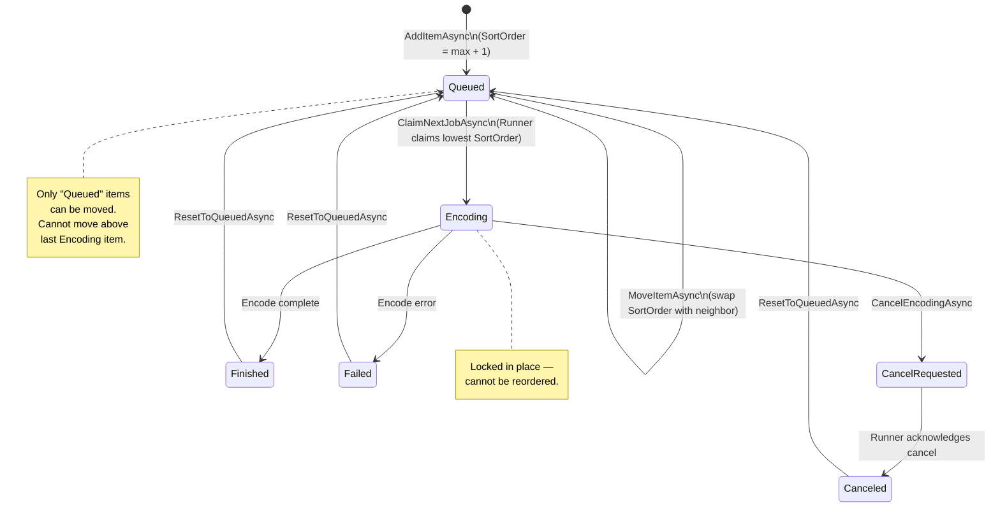
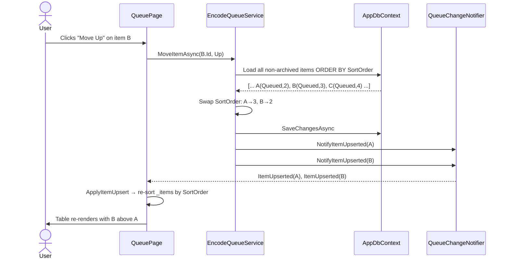
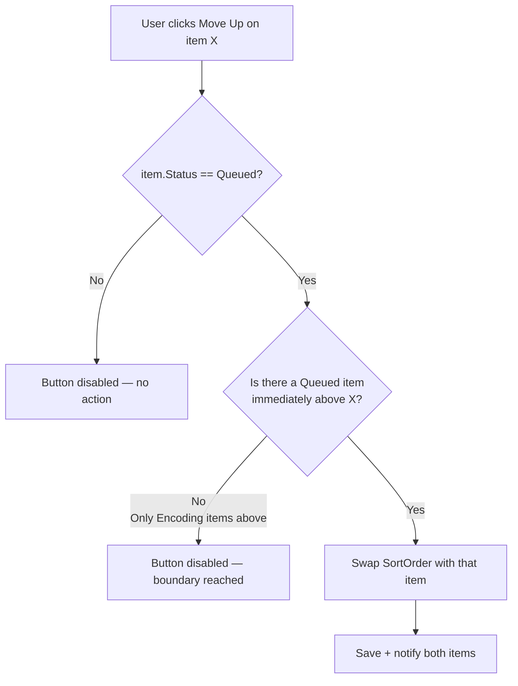

# Queue Reordering

## Overview

The encoding queue currently processes jobs in the order they were added (`CreatedAt` ascending). This plan adds the ability for users to manually reorder jobs that are in the **Queued** state, so higher-priority discs can be moved ahead of others. Jobs that are actively encoding (or awaiting cancellation) are locked in place and cannot participate in reordering.

## Business Domain

Encoding Queue Management

## Goals

- Users can move a **Queued** item up or down within the queue.
- A Queued item cannot be moved above any item that is currently **Encoding** or **CancelRequested** — it can only be placed directly underneath the last active encoding job.
- Items in any non-Queued state (Encoding, CancelRequested, Finished, Failed, Canceled) cannot be reordered.
- The runner picks up jobs in the new user-defined order rather than insertion order.
- Newly added items are always appended at the end of the queue.
- Reorder operations are reflected in real time on all connected clients via the existing SignalR / `QueueChangeNotifier` infrastructure.

## Non-Goals

- Automatic/priority-based scheduling — reordering is fully manual.
- Reordering items across status boundaries other than those described above.
- Bulk reordering (moving multiple items at once).
- Priority levels or weighted scheduling — this is purely manual positional reordering.

---

## Architecture / Design

### Affected Projects

| Project | Role |
|---|---|
| `Sannel.Encoding.Manager.Data` | Add `SortOrder` property to `EncodeQueueItem` entity |
| `Sannel.Encoding.Manager.Migrations.Sqlite` | Migration to add `SortOrder` column and backfill from `CreatedAt` |
| `Sannel.Encoding.Manager.Migrations.Postgres` | Same migration for PostgreSQL |
| `Sannel.Encoding.Manager.Web` | New service method, API endpoint, and UI changes to `QueuePage` |
| `Sannel.Encoding.Runner` | No code change — the `claim-next` API on the Web side already controls ordering |

### Feature Folder Structure

No new folders are required. Changes are spread across existing files:

```
src/
├── Sannel.Encoding.Manager.Data/
│   └── Features/Queue/Entities/
│       └── EncodeQueueItem.cs          ← add SortOrder property
├── Sannel.Encoding.Manager.Web/
│   └── Features/
│       ├── Queue/
│       │   ├── Services/
│       │   │   ├── IEncodeQueueService.cs   ← add MoveItemAsync
│       │   │   └── EncodeQueueService.cs    ← implement MoveItemAsync; fix AddItemAsync; fix GetItemsAsync
│       │   └── Pages/
│       │       ├── QueuePage.razor          ← add Up/Down buttons per row
│       │       └── QueuePage.razor.cs       ← add MoveUpAsync / MoveDownAsync handlers + disabled logic
│       └── Runner/
│           └── Services/
│               └── RunnerJobService.cs      ← change OrderBy(CreatedAt) → OrderBy(SortOrder)
├── Sannel.Encoding.Manager.Migrations.Sqlite/
│   └── Migrations/                          ← new migration
└── Sannel.Encoding.Manager.Migrations.Postgres/
    └── Migrations/                          ← new migration
```

### Data Model Changes

**Entity: `EncodeQueueItem`** (in `Sannel.Encoding.Manager.Data`)

Add one new property:

| Property | Type | Notes |
|---|---|---|
| `SortOrder` | `int` | Lower value = higher priority. Default `0`; assigned on add. |

**Migration backfill strategy:** The migration must initialize `SortOrder` for all existing rows. Each provider should use a SQL statement that assigns sequential integers based on `CreatedAt` ascending (so existing order is preserved):

- **SQLite**: Use a `WITH` CTE or a correlated sub-query: `UPDATE EncodeQueueItems SET SortOrder = (SELECT COUNT(*) FROM EncodeQueueItems e2 WHERE e2.CreatedAt < EncodeQueueItems.CreatedAt)`
- **PostgreSQL**: `UPDATE "EncodeQueueItems" SET "SortOrder" = sub.rn - 1 FROM (SELECT "Id", ROW_NUMBER() OVER (ORDER BY "CreatedAt") - 1 AS rn FROM "EncodeQueueItems") sub WHERE "EncodeQueueItems"."Id" = sub."Id"`

> **Migrations required for BOTH SQLite and PostgreSQL providers.**

### API / Controller Changes

None. Reordering is handled via direct service calls from the Blazor Server UI (`IEncodeQueueService` is injected into `QueuePage`). No HTTP endpoint is needed.

### Service Layer

**`IEncodeQueueService`** — add:

```
Task<bool> MoveItemAsync(Guid id, MoveDirection direction, CancellationToken ct = default)
```

Where `MoveDirection` is a new enum: `Up`, `Down`.

**`EncodeQueueService` — `MoveItemAsync` pseudocode:**

```
1. Load all non-archived items ordered by SortOrder (already consistent ordering).
2. Find the item by id. If not found, return false.
3. Guard: if item.Status != "Queued", return false.
4. Find the swap target:
   - For Up: the item immediately above (lower SortOrder) that is also "Queued".
     - If none exists (item is already directly below the last Encoding item), return false.
   - For Down: the item immediately below (higher SortOrder) that is also "Queued".
     - If none exists (item is already last), return false.
5. Swap SortOrder values between the two items.
6. SaveChangesAsync.
7. Notify both items via QueueChangeNotifier.
8. Return true.
```

**`IEncodeQueueService`** — also add:

```
Task<bool> MoveToIndexAsync(Guid id, int targetIndex, CancellationToken ct = default)
```

This is called by the drag-and-drop `ItemDropped` handler. It re-sequences `SortOrder` across all affected items (between the item's old and new positions) in a single transaction.

**`EncodeQueueService` — `AddItemAsync` change:**

Assign `item.SortOrder = (await ctx.EncodeQueueItems.MaxAsync(i => (int?)i.SortOrder) ?? -1) + 1` before saving, so new items always land at the end.

**`EncodeQueueService` — `ResetToQueuedAsync` change:**

After resetting status to `"Queued"`, assign `SortOrder = max + 1` so the item is appended at the end of the queue.

**`EncodeQueueService` — `GetItemsAsync` change:**

Change `OrderBy(i => i.CreatedAt)` → `OrderBy(i => i.SortOrder)`.

**`RunnerJobService` — `ClaimNextJobAsync` change:**

Change `OrderBy(i => i.CreatedAt)` → `OrderBy(i => i.SortOrder)` so the runner claims the highest-priority Queued item.

### UI Changes

**`QueuePage.razor` / `QueuePage.razor.cs`**

The current `MudTable` is replaced with a `MudDropContainer<EncodeQueueItem>` wrapping a single `MudDropZone` with `AllowReorder="true"`. This provides both drag-and-drop reordering and keeps the existing row layout via a custom `ItemRenderer`. Arrow buttons are also included as a keyboard/accessibility alternative.

**Drop container structure (pseudocode):**
```
<MudDropContainer T="EncodeQueueItem"
    Items="_items"
    ItemsSelector="@((item, _) => true)"
    ItemDropped="OnItemDroppedAsync"
    ItemDisabled="@(item => item.Status != "Queued")">
  <ChildContent>
    <MudDropZone T="EncodeQueueItem" AllowReorder="true" />
  </ChildContent>
  <ItemRenderer>
    @* render each row with all existing columns + Up/Down arrow buttons *@
  </ItemRenderer>
</MudDropContainer>
```

Key properties:
- `ItemDisabled` — returns `true` for any item that is not Queued; those rows render normally but cannot be dragged.
- `CanDrop` — not needed at the zone level; boundary enforcement is done in the `ItemDropped` callback.

**`OnItemDroppedAsync(MudItemDropInfo<EncodeQueueItem> info)` pseudocode:**
```
1. newIndex = info.IndexInZone
2. Determine lastNonQueuedIndex = index of the last item in _items whose status is Encoding or CancelRequested.
3. If newIndex <= lastNonQueuedIndex, clamp newIndex to lastNonQueuedIndex + 1.
4. Re-sequence: rebuild the full SortOrder for all items based on the new position.
5. Call EncodeQueueService.MoveToIndexAsync(info.Item.Id, clampedIndex) — see Service Layer update below.
```

**Arrow buttons (also in `ItemRenderer`):**
```
MudIconButton  Icon=ArrowUpward   Title="Move up"   Disabled=@(!CanMoveUp(context))
MudIconButton  Icon=ArrowDownward Title="Move down" Disabled=@(!CanMoveDown(context))
```

**`CanMoveUp(item)` / `CanMoveDown(item)`** inspect `_items` locally (no server call). Both return `false` if `item.Status != "Queued"`. `CanMoveUp` also returns `false` if there is no Queued item immediately above. `CanMoveDown` returns `false` if the item is already last.

**Arrow button handlers** call `EncodeQueueService.MoveItemAsync(id, MoveDirection.Up/Down)` directly (no HTTP round-trip). `QueueChangeNotifier` propagates updates to all connected clients automatically.

### Runner / Background Processing

The runner (`Sannel.Encoding.Runner`) itself requires **no code changes**. It calls `POST api/runner/claim-next` on the web server, and the fix in `RunnerJobService.ClaimNextJobAsync` (order by `SortOrder` instead of `CreatedAt`) is sufficient to make it respect the new user-defined order.

---

## Diagrams

### Queue State: What Can Be Reordered



### Move Up Operation — Sequence



### Boundary Constraint: Cannot Move Above Encoding



---

## Acceptance Criteria

1. A Queued item in the middle of the queue can be moved up by clicking the Move Up button; it swaps position with the Queued item immediately above it.
2. A Queued item in the middle of the queue can be moved down by clicking the Move Down button; it swaps position with the Queued item immediately below it.
3. The Move Up button is disabled for the topmost Queued item (i.e., there is no Queued item above it, even if Encoding items exist above).
4. The Move Down button is disabled for the bottommost item in the queue.
5. Move Up and Move Down buttons are both disabled for any item whose status is not Queued (Encoding, CancelRequested, Finished, Failed, Canceled).
6. A Queued item can be dragged and dropped to a new position within the queue using `MudDropContainer` / `MudDropZone`.
7. Non-Queued items (Encoding, CancelRequested, etc.) cannot be dragged.
8. Dragging a Queued item above an Encoding or CancelRequested item is blocked — it is clamped to the position directly below the last active item.
9. After a reorder, the Runner's next `claim-next` call claims the item with the lowest `SortOrder` among Queued items.
10. Newly added queue items always appear at the bottom of the queue (highest `SortOrder`).
11. An item reset from Failed/Finished/Canceled back to Queued is appended at the end of the queue.
12. Existing queue items retain their relative `CreatedAt`-based order after the migration runs (backfill preserves prior ordering).
13. All connected browser clients see the updated order in real time without a page refresh.
14. The new `SortOrder` column is present and correctly backfilled after running migrations against both a SQLite and a PostgreSQL database.

---

## Open Questions

None. All questions have been resolved:

- **Direct service call vs HTTP controller:** Direct service call only — no REST endpoint needed.
- **UI gesture:** Both drag-and-drop (`MudDropContainer` / `MudDropZone` with `AllowReorder`) and arrow buttons. No additional NuGet packages required — `MudBlazor` v9 includes this built in.
- **Reset-to-queued SortOrder:** Always append at the end of the queue (`SortOrder = max + 1`).
