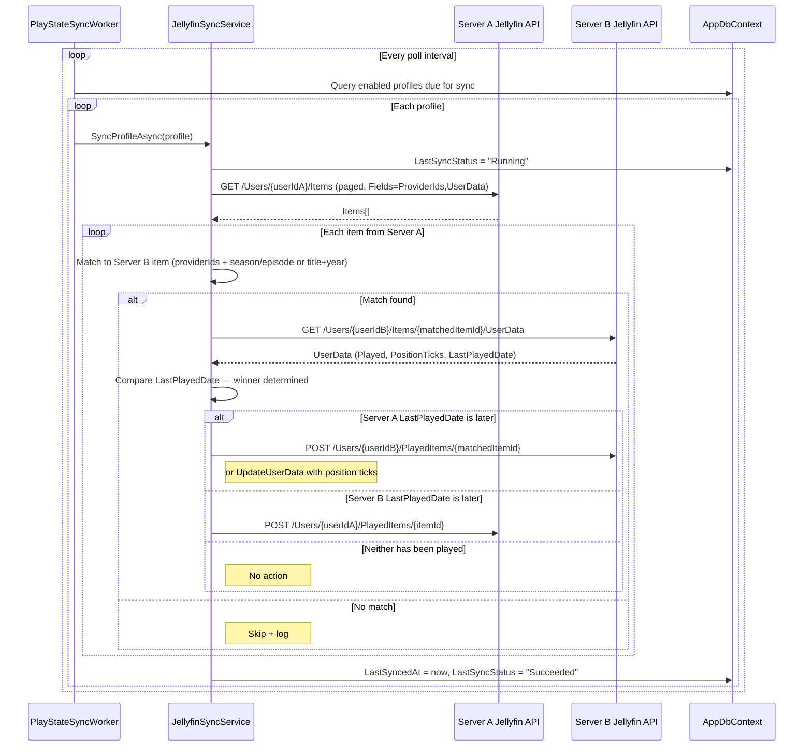
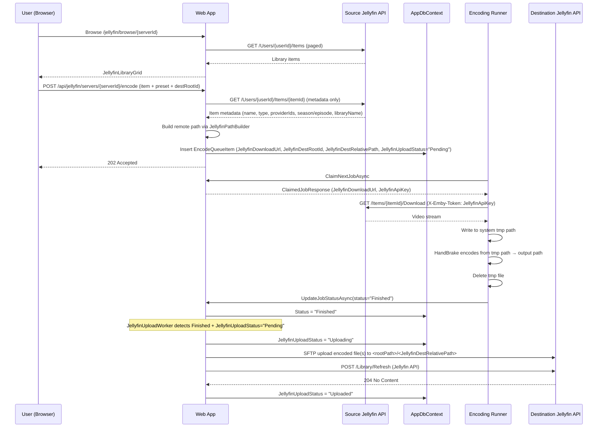
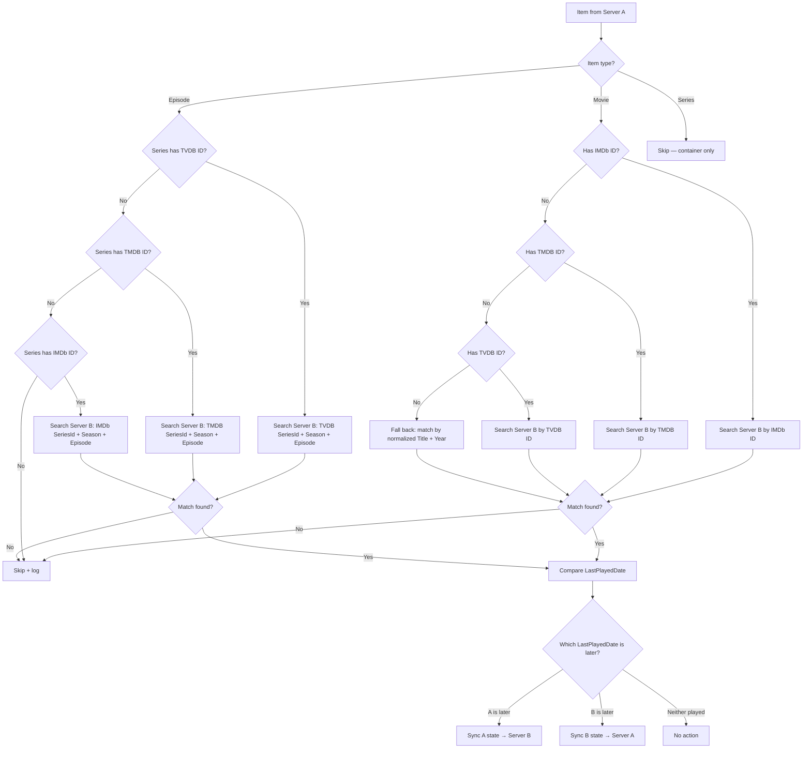
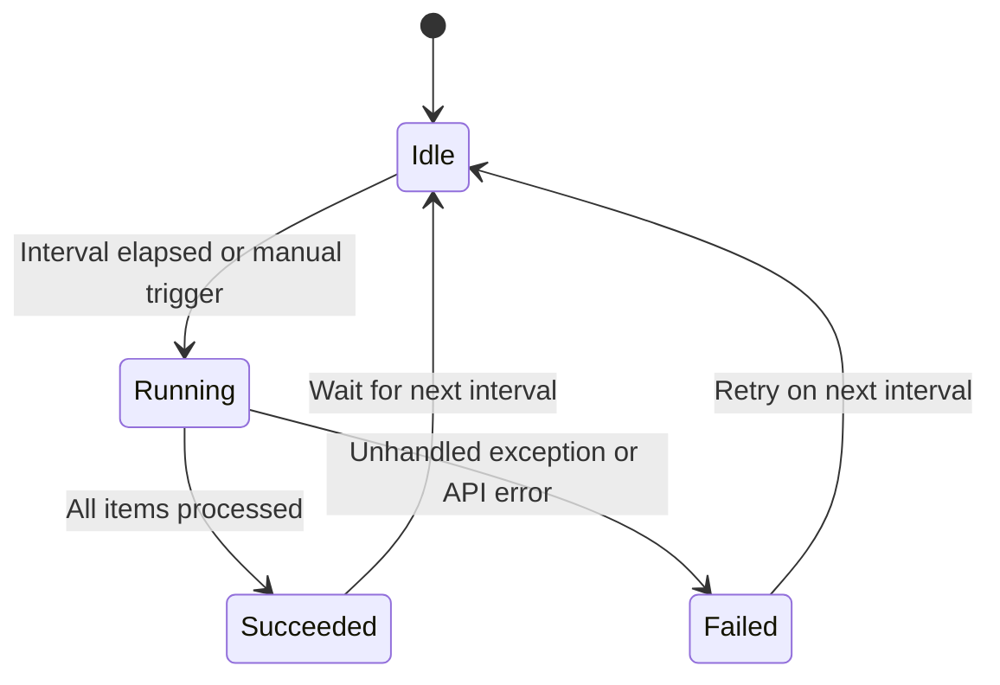
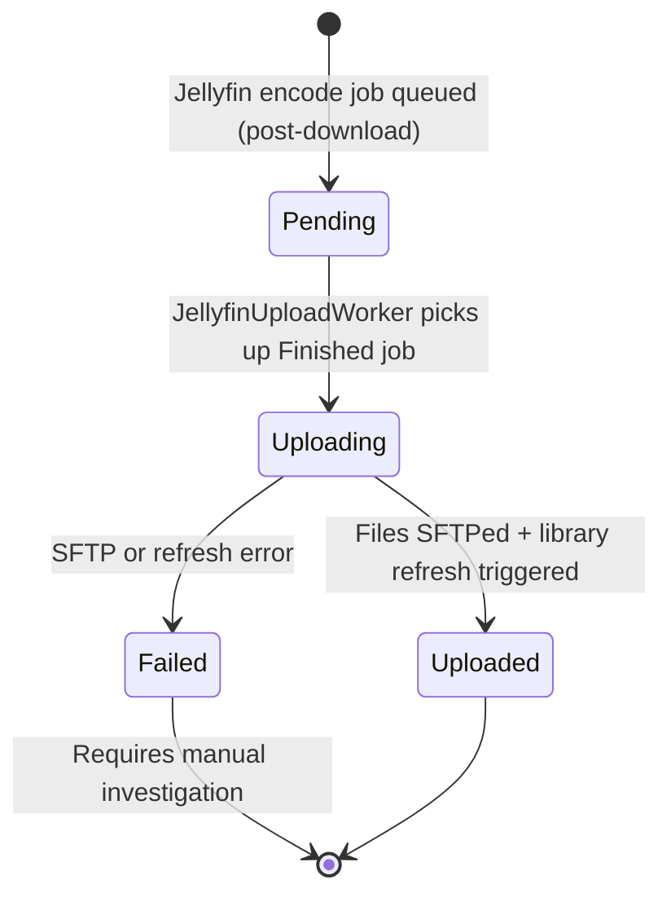
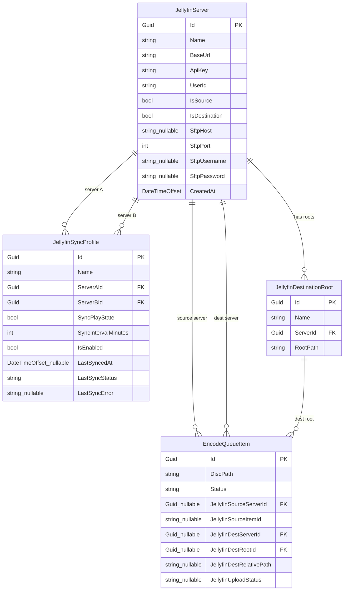

# Jellyfin Sync

## Overview

This feature adds Jellyfin integration to the Encoding Manager. It consists of two related capabilities: a background play-state synchronization service that bidirectionally mirrors watched/unwatched status and playback positions between two Jellyfin servers (whichever has the most recent `LastPlayedDate` wins), and an encode-for-Jellyfin workflow that allows users to select items from a source Jellyfin library, have the encoding runner download the source to a local tmp directory on the runner machine, transcode it via the runner/HandBrake pipeline — deleting the tmp file immediately after encoding — and then upload the encoded output via SFTP to a configured destination root path on the destination Jellyfin server and trigger a library refresh. Sensitive credentials (API keys, SFTP passwords) are encrypted at rest using ASP.NET Core Data Protection.

## Business Domain

Jellyfin Integration

## Goals

- Users can configure one or more named Jellyfin servers (URL + API key + per-server user ID) that act as sources, destinations, or both.
- A sync profile links two servers bidirectionally: whichever server has the most recent `LastPlayedDate` for a matched item wins, and play state / position ticks flow in that direction.
- Item matching does **not** rely on server-specific item IDs. TV episodes are matched by series provider ID (TVDB → TMDB → IMDb) + season number + episode number; movies are matched by provider ID or (as a fallback) title + year.
- A background service periodically runs each enabled sync profile automatically.
- Users can browse a configured source Jellyfin library in the UI, select an item, and queue it for transcoding.
- Before encoding begins, the runner downloads the source video from the Jellyfin source server to a local tmp directory on the runner machine; the tmp file is deleted after encoding completes regardless of success or failure.
- One or more named destination root paths can be configured per destination server. When queuing an encode job, the user selects a root and the system auto-builds the full remote SFTP path using the template `<rootPath>/<LibraryName>/<ShowOrMovieName> ([tvdbid-<id>] if available)/<SeasonOrMovieDir>/<filename>`.
- Sensitive credentials (API keys, SFTP passwords) are encrypted at rest using ASP.NET Core Data Protection.
- Source and destination server settings are configurable through the UI.
- A Jellyfin management page shows server connectivity status, active sync profiles, last sync time, and upload statuses.

## Non-Goals

- Real-time streaming or proxy transcoding through the Encoding Manager.
- Syncing metadata, artwork, or subtitle files between servers.
- Authentication via username/password — API key only.
- Syncing library items that have no shared provider IDs **and** no matching title+year (movies) — these are skipped and logged.

---

## Architecture / Design

### Affected Projects

| Project | Role |
|---|---|
| `Sannel.Encoding.Manager.Jellyfin` | **New.** Hand-rolled Jellyfin REST API client library built from `https://api.jellyfin.org/openapi/jellyfin-openapi-stable.json`. Consumed only by the web project. |
| `Sannel.Encoding.Manager.Data` | **Modified.** Two new entities (`JellyfinServer`, `JellyfinSyncProfile`). `EncodeQueueItem` gains new nullable fields for Jellyfin-sourced jobs. `AppDbContext` updated. |
| `Sannel.Encoding.Manager.Migrations.Sqlite` | **Modified.** New migration. |
| `Sannel.Encoding.Manager.Migrations.Postgres` | **Modified.** New migration. |
| `Sannel.Encoding.Manager.Web` | **Modified.** New `Features/Jellyfin/` vertical slice with pages, services, background workers, DTOs. NavMenu updated. |
| `Sannel.Encoding.Runner` | **Modified.** When `ClaimedJobResponse` includes a `JellyfinDownloadUrl`, the runner HTTP-downloads the source file to a system tmp path before invoking HandBrake, then deletes the tmp file after encoding completes (success or failure). |

---

### New Project: `Sannel.Encoding.Manager.Jellyfin`

A dedicated class library referenced by `Sannel.Encoding.Manager.Web`. Building the client by hand from the Jellyfin OpenAPI spec at `https://api.jellyfin.org/openapi/jellyfin-openapi-stable.json` avoids third-party SDK dependencies and makes the client's surface area match exactly what this feature needs.

**Location:** `src/Sannel.Encoding.Manager.Jellyfin/Sannel.Encoding.Manager.Jellyfin.csproj`

Targets `net10.0`. Uses `System.Net.Http.Json` and `System.Text.Json` with `JsonSerializerOptions.Web` defaults. No third-party Jellyfin SDK — the client surface is purpose-built for exactly what this feature needs.

#### NuGet Dependencies

| Package | Version | Purpose |
|---|---|---|
| `SSH.NET` (`Renci.SshNet`) | 2024.2.0 | SFTP client for uploading encoded files to the destination server |

All other functionality uses framework-provided APIs only.

#### Authentication

Jellyfin authenticates outbound API calls via the `X-Emby-Token` request header. The format is:

```
X-Emby-Token: <api-key>
```

A `JellyfinAuthHandler : DelegatingHandler` injects this header on every request using the configured API key for the target server. Because the Encoding Manager manages multiple servers simultaneously, `JellyfinClient` is **not** a singleton — a new named `HttpClient` (via `IHttpClientFactory`) is created per server using the server's stored API key.

#### Jellyfin API Endpoints Implemented

All routes are relative to the configured `BaseUrl` for the server:

| Method | Route | Purpose |
|---|---|---|
| `GET` | `/System/Info` | Validate connectivity; retrieve server version and ID |
| `GET` | `/Users` | List all users (used to validate `UserId` configuration) |
| `GET` | `/Users/{userId}/Items` | List library items with `IncludeItemTypes`, `Recursive`, `Fields`, `ParentId`, `SearchTerm`, `StartIndex`, `Limit` query params |
| `GET` | `/Users/{userId}/Items/{itemId}` | Fetch a single item with `Fields=ProviderIds,UserData` |
| `POST` | `/Users/{userId}/PlayedItems/{itemId}` | Mark an item as played (optionally supply `datePlayed`) |
| `DELETE` | `/Users/{userId}/PlayedItems/{itemId}` | Mark an item as unplayed |
| `POST` | `/Users/{userId}/Items/{itemId}/UserData` | Update user data (position ticks, played state) |
| `GET` | `/Items/{itemId}/Download` | Stream the original media file for pre-download |
| `POST` | `/Library/Refresh` | Trigger a full library refresh on the destination server |

---

### Feature Folder Structure

```
src/
├── Sannel.Encoding.Manager.Jellyfin/               # NEW project
│   ├── Sannel.Encoding.Manager.Jellyfin.csproj
│   ├── IJellyfinClient.cs
│   ├── JellyfinClient.cs
│   ├── JellyfinAuthHandler.cs                      # DelegatingHandler — injects X-Emby-Token auth header
│   ├── IJellyfinClientFactory.cs
│   ├── JellyfinClientFactory.cs
│   └── Dto/
│       ├── JellyfinSystemInfo.cs                   # Id, ServerName, Version
│       ├── JellyfinUser.cs                         # Id, Name
│       ├── JellyfinItem.cs                         # Id, Name, Type, ProductionYear, ProviderIds, UserData, IndexNumber, ParentIndexNumber, SeriesName, SeriesId
│       ├── JellyfinUserData.cs                     # Played, PlaybackPositionTicks, LastPlayedDate
│       ├── JellyfinProviderIds.cs                  # Tvdb, Tmdb, Imdb (all nullable strings)
│       ├── GetItemsRequest.cs                      # Parameters for /Users/{userId}/Items
│       └── ItemsResponse.cs                        # Items: JellyfinItem[], TotalRecordCount
│
└── Sannel.Encoding.Manager.Web/
    └── Features/
        └── Jellyfin/                               # NEW feature slice
            ├── Pages/
            │   ├── JellyfinPage.razor              # @page "/jellyfin" — server + profile management
            │   ├── JellyfinPage.razor.cs
            │   ├── JellyfinBrowsePage.razor        # @page "/jellyfin/browse/{ServerId:guid}"
            │   └── JellyfinBrowsePage.razor.cs
            ├── Components/
            │   ├── ServerConfigDialog.razor        # MudDialog: add/edit JellyfinServer
            │   ├── ServerConfigDialog.razor.cs
            │   ├── SyncProfileDialog.razor         # MudDialog: add/edit JellyfinSyncProfile
            │   ├── SyncProfileDialog.razor.cs
            │   ├── QueueJellyfinItemDialog.razor   # MudDialog: pick preset + dest server + dest path
            │   ├── QueueJellyfinItemDialog.razor.cs
            │   └── JellyfinLibraryGrid.razor       # MudDataGrid of paged library items
            ├── Dto/
            │   ├── JellyfinServerDto.cs
            │   ├── JellyfinSyncProfileDto.cs
            │   ├── JellyfinDestinationRootDto.cs
            │   └── JellyfinEncodeRequest.cs        # ServerId, ItemId, PresetLabel, DestServerId, DestRootId
            ├── Services/
            │   ├── IJellyfinServerService.cs       # CRUD for JellyfinServer + JellyfinDestinationRoot entities
            │   ├── JellyfinServerService.cs
            │   ├── IJellyfinSyncService.cs         # Bidirectional play-state sync for one profile
            │   ├── JellyfinSyncService.cs
            │   ├── IJellyfinSftpService.cs         # SFTP upload of encoded files to destination server
            │   ├── JellyfinSftpService.cs
            │   ├── IJellyfinPathBuilder.cs         # Builds remote SFTP path from item metadata + root
            │   ├── JellyfinPathBuilder.cs
            │   ├── IJellyfinEncodeService.cs       # Queue Jellyfin jobs + post-encode SFTP upload
            │   └── JellyfinEncodeService.cs
            ├── BackgroundServices/
            │   ├── PlayStateSyncWorker.cs          # BackgroundService — periodic sync per profile
            │   └── JellyfinUploadWorker.cs         # BackgroundService — post-encode SFTP upload + refresh
            └── Options/
                └── JellyfinOptions.cs              # SyncPollIntervalSeconds, UploadPollIntervalSeconds, MaxConcurrentSyncs
```

---

### Data Model Changes

Migrations are required for **both** SQLite and PostgreSQL providers.

#### New Entity: `JellyfinServer`

**Location:** `src/Sannel.Encoding.Manager.Data/Features/Jellyfin/Entities/JellyfinServer.cs`

| Property | Type | Notes |
|---|---|---|
| `Id` | `Guid` | PK |
| `Name` | `string` | Display name (e.g., "Home Server") |
| `BaseUrl` | `string` | e.g., `http://192.168.1.10:8096` |
| `ApiKey` | `string` | Jellyfin API key |
| `UserId` | `string` | Jellyfin user ID for play-state and download operations on **this** server |
| `IsSource` | `bool` | May be selected as encode source / sync participant |
| `IsDestination` | `bool` | May be selected as encode destination / sync participant |
| `SftpHost` | `string?` | SFTP hostname or IP; if `null`, the hostname from `BaseUrl` is used |
| `SftpPort` | `int` | SFTP port (default: `22`) |
| `SftpUsername` | `string?` | SFTP login username; required when `IsDestination = true` |
| `SftpPassword` | `string?` | SFTP login password; required when `IsDestination = true` |
| `CreatedAt` | `DateTimeOffset` | Creation timestamp |

> `SftpHost`, `SftpUsername`, and `SftpPassword` are only validated/required when the server is used as an encode destination. `ApiKey` and `SftpPassword` are encrypted at rest using an EF Core value converter backed by ASP.NET Core Data Protection (`IDataProtectionProvider`); plaintext values are never written to the database.

#### New Entity: `JellyfinSyncProfile`

**Location:** `src/Sannel.Encoding.Manager.Data/Features/Jellyfin/Entities/JellyfinSyncProfile.cs`

| Property | Type | Notes |
|---|---|---|
| `Id` | `Guid` | PK |
| `Name` | `string` | Display name |
| `ServerAId` | `Guid` | FK → `JellyfinServer` (first server in the pair) |
| `ServerBId` | `Guid` | FK → `JellyfinServer` (second server in the pair) |
| `SyncPlayState` | `bool` | Whether to sync play state |
| `SyncIntervalMinutes` | `int` | Default: `60` |
| `IsEnabled` | `bool` | Whether the profile is active |
| `LastSyncedAt` | `DateTimeOffset?` | When the last cycle completed |
| `LastSyncStatus` | `string` | `"Idle"` \| `"Running"` \| `"Succeeded"` \| `"Failed"` |
| `LastSyncError` | `string?` | Error from last failed cycle |

> The profile is symmetric (A ↔ B) — sync direction is determined per-item at runtime by comparing `LastPlayedDate` on each side. There is no fixed “source” or “destination” for play-state sync.

#### New Entity: `JellyfinDestinationRoot`

**Location:** `src/Sannel.Encoding.Manager.Data/Features/Jellyfin/Entities/JellyfinDestinationRoot.cs`

| Property | Type | Notes |
|---|---|---|
| `Id` | `Guid` | PK |
| `Name` | `string` | Display label (e.g., “NAS Movies”) |
| `ServerId` | `Guid` | FK → `JellyfinServer` (must be a destination server) |
| `RootPath` | `string` | Absolute SFTP path on the destination server (e.g., `/media/jellyfin/movies`) |

One destination server may have multiple roots (e.g., one for movies, one for TV series).

#### Modified Entity: `EncodeQueueItem`

New nullable columns — all are `null` for non-Jellyfin jobs (fully backwards-compatible):

| Property | Type | Notes |
|---|---|---|
| `JellyfinSourceServerId` | `Guid?` | FK → `JellyfinServer` |
| `JellyfinSourceItemId` | `string?` | Item ID on the source Jellyfin server |
| `JellyfinDestServerId` | `Guid?` | FK → `JellyfinServer`; server to refresh after encode |
| `JellyfinDestRootId` | `Guid?` | FK → `JellyfinDestinationRoot`; selected root path for SFTP delivery |
| `JellyfinDestRelativePath` | `string?` | Auto-built relative path within the root (e.g., `Movies/The Matrix (1999)/The Matrix (1999).mkv`) |
| `JellyfinUploadStatus` | `string?` | `null` \| `"Pending"` \| `"Uploading"` \| `"Uploaded"` \| `"Failed"` |

---

### API / Controller Changes

The runner API is **not changed**. A new web-side controller is added:

**`JellyfinController`** — route prefix `/api/jellyfin`

| Method | Route | Description | Auth |
|---|---|---|---|
| `GET` | `/servers/{serverId}/ping` | Returns connectivity status (calls `GET /System/Info` on the configured server) | User |
| `GET` | `/servers/{serverId}/items` | Paged library browser proxy; accepts `type`, `search`, `parentId`, `page`, `pageSize` | User |
| `POST` | `/servers/{serverId}/encode` | Accepts `JellyfinEncodeRequest`; resolves item metadata, builds remote path, and inserts the queue item | User |
| `GET` | `/servers/{serverId}/destination-roots` | Lists `JellyfinDestinationRoot` records for a server | User |
| `POST` | `/servers/{serverId}/destination-roots` | Creates a destination root | User |
| `PUT` | `/destination-roots/{rootId}` | Updates a destination root | User |
| `DELETE` | `/destination-roots/{rootId}` | Deletes a destination root | User |
| `POST` | `/sync-profiles/{profileId}/run` | Immediately triggers a sync cycle for the given profile | User |

#### Runner API Change: `ClaimedJobResponse`

The `ClaimedJobResponse` DTO (returned by the existing job-claim endpoint consumed by `Sannel.Encoding.Runner`) gains two new optional fields for Jellyfin-sourced jobs:

| Field | Type | Notes |
|---|---|---|
| `JellyfinDownloadUrl` | `string?` | Full URL to stream the source media file (`{BaseUrl}/Items/{itemId}/Download`) |
| `JellyfinApiKey` | `string?` | Decrypted API key to use as `X-Emby-Token` when downloading |

When both fields are non-null, the runner treats the job as a Jellyfin-sourced download. When either is null, the runner behaves exactly as today.

---

### Service Layer

#### `IJellyfinClientFactory` / `JellyfinClientFactory`

Creates an `IJellyfinClient` scoped to a specific `JellyfinServer`. Uses `IHttpClientFactory` internally:

```
IJellyfinClient CreateClient(JellyfinServer server)
```

#### `IJellyfinClient` / `JellyfinClient`

Low-level HTTP client. Key pseudocode signatures:

```
Task<JellyfinSystemInfo?> GetSystemInfoAsync(CancellationToken ct)
Task<IReadOnlyList<JellyfinUser>> GetUsersAsync(CancellationToken ct)
Task<ItemsResponse> GetItemsAsync(string userId, GetItemsRequest request, CancellationToken ct)
Task<JellyfinItem?> GetItemAsync(string userId, string itemId, CancellationToken ct)
Task<JellyfinUserData?> GetUserDataAsync(string userId, string itemId, CancellationToken ct)
Task MarkPlayedAsync(string userId, string itemId, DateTimeOffset datePlayed, CancellationToken ct)
Task MarkUnplayedAsync(string userId, string itemId, CancellationToken ct)
Task UpdateUserDataAsync(string userId, string itemId, JellyfinUserData data, CancellationToken ct)
Task DownloadItemAsync(string itemId, Stream destination, CancellationToken ct)
Task RefreshLibraryAsync(CancellationToken ct)
```

`JellyfinClient` is **not** registered in DI directly. Instead, `IJellyfinClientFactory` creates one scoped to the server's API key and base URL.

#### `IJellyfinSyncService` / `JellyfinSyncService`

Runs one full bidirectional sync cycle for a `JellyfinSyncProfile`:

```
Task SyncProfileAsync(JellyfinSyncProfile profile, CancellationToken ct)
```

**Item matching strategy** (applied before comparing user data):

- **TV Episodes**: Match by series provider ID (TVDB preferred, then TMDB, then IMDb) + `ParentIndexNumber` (season) + `IndexNumber` (episode). Both sides must yield a result to proceed.
- **Movies**: Match by provider ID (IMDb preferred, then TMDB, then TVDB). If no provider ID match, fall back to normalized title + `ProductionYear` comparison. Unmatched movies are skipped and logged.
- **Series** (container items): Skipped — only leaf-level Episode and Movie items carry user-play data.

Matching is done by calling `GET /Users/{userId}/Items` with the appropriate filter parameters on the other server, not by assuming item IDs are shared.

**Sync direction logic** (per matched pair):

1. Retrieve `UserData` for the item from Server A and Server B (each using its own `UserId`).
2. If only one side has `LastPlayedDate`, that side wins.
3. If both sides have `LastPlayedDate`, the later date wins.
4. Apply `MarkPlayedAsync` or `MarkUnplayedAsync` + `UpdateUserDataAsync` on the losing side to bring it in line.
5. If neither side has ever been played, no action is taken.

#### `IJellyfinSftpService` / `JellyfinSftpService`

Wraps SSH.NET (`Renci.SshNet`) to provide a testable, async-friendly SFTP upload abstraction:

```
Task UploadFileAsync(JellyfinServer destServer, string localFilePath, string remoteFilePath, CancellationToken ct)
```

The `remoteFilePath` is the full remote path including filename (e.g., `/media/tv/ShowName/Season 01/Episode.mkv`). The service connects using the `JellyfinServer.SftpHost` (falling back to the hostname parsed from `BaseUrl`), `SftpPort`, `SftpUsername`, and `SftpPassword`. The connection is opened per-upload call and disposed immediately after.

#### `IJellyfinPathBuilder` / `JellyfinPathBuilder`

Builds the full remote SFTP path for an encoded item from its Jellyfin metadata and the selected `JellyfinDestinationRoot`:

```
string BuildRemotePath(JellyfinDestinationRoot root, JellyfinItem item)
```

**Path template applied by the builder:**

- **Movies**: `{root.RootPath}/{LibraryName}/{Title} ({Year}) [tvdbid-{TvdbId}]/{Title} ({Year}).{ext}` — the `[tvdbid-...]` segment uses `[tmdbid-...]` or `[imdbid-...]` if TVDB is absent; the segment is omitted entirely if no provider ID is available.
- **TV Episodes**: `{root.RootPath}/{LibraryName}/{SeriesName} [tvdbid-{SeriesTvdbId}]/Season {SeasonNumber:D2}/{SeriesName} S{SeasonNumber:D2}E{EpisodeNumber:D2} - {EpisodeTitle}.{ext}`

Illegal filesystem characters in name segments are stripped before path composition. The `ext` is inferred from the encode preset output format.

#### `IJellyfinEncodeService` / `JellyfinEncodeService`

```
Task<EncodeQueueItem> QueueItemAsync(JellyfinEncodeRequest request, CancellationToken ct)
Task HandleEncodeCompletedAsync(Guid queueItemId, CancellationToken ct)
```

**`QueueItemAsync` flow:**
1. Look up the `JellyfinServer` for the source.
2. Call `IJellyfinClient.GetItemAsync` to retrieve item metadata (name, type, provider IDs, season/episode numbers, library name).
3. Call `IJellyfinPathBuilder.BuildRemotePath` using the selected `JellyfinDestinationRoot` and item metadata to compute `JellyfinDestRelativePath`.
4. Insert an `EncodeQueueItem` with all Jellyfin fields populated (`JellyfinSourceServerId`, `JellyfinSourceItemId`, `JellyfinDestServerId`, `JellyfinDestRootId`, `JellyfinDestRelativePath`, `JellyfinUploadStatus = "Pending"`). `DiscPath` is left null — the runner will download to its own tmp path.
5. The web server does **not** download the source file; downloading is delegated to the runner via `ClaimedJobResponse`.

**`HandleEncodeCompletedAsync` flow** (called by `JellyfinUploadWorker`):
1. Load the `EncodeQueueItem` and its track configs from `TracksJson`.
2. Resolve each encoded output file’s absolute path (via the runner’s `TrackDestinationRoot` + resolved template path).
3. Set `JellyfinUploadStatus = "Uploading"`, save.
4. For each output file, call `IJellyfinSftpService.UploadFileAsync` to transfer it to `<JellyfinDestinationRoot.RootPath>/<JellyfinDestRelativePath>` on the destination server.
5. Call `IJellyfinClient.RefreshLibraryAsync` on the destination server.
6. Set `JellyfinUploadStatus = "Uploaded"`, save.
7. On any error: set `JellyfinUploadStatus = "Failed"`, log the error. Do **not** delete encoded files.

---

### UI Changes

#### `JellyfinPage.razor` — `/jellyfin`

Three `MudTabs`:

- **Servers**: `MudDataGrid` listing `JellyfinServer` records. Columns: name, URL, user ID, source/destination tags, live ping status (`MudChip`: Online / Offline / Checking). Row actions: Edit (opens `ServerConfigDialog`), Delete. Add button triggers `ServerConfigDialog` in create mode. `ServerConfigDialog` includes SFTP fields (host, port, username, password) in an expandable "SFTP / File Delivery" section shown when `IsDestination = true`. API key and SFTP password are rendered as password-type inputs and are encrypted via ASP.NET Core Data Protection before being saved.
- **Destination Roots**: `MudDataGrid` listing `JellyfinDestinationRoot` records for all servers. Columns: display name, server name, SFTP root path. Row actions: Edit, Delete. Add button opens an inline dialog to select a destination server, enter a display name, and enter the SFTP root path.
- **Sync Profiles**: `MudDataGrid` listing `JellyfinSyncProfile` records. Columns: name, Server A name, Server B name, interval, enabled toggle, last sync time, status chip, “Sync Now” button. Row actions: Edit (opens `SyncProfileDialog`), Delete.

#### `JellyfinBrowsePage.razor` — `/jellyfin/browse/{ServerId:guid}`

- `MudSelect` for item type filter (`Movies`, `Series`, `Episodes`).
- `MudTextField` for keyword search.
- `JellyfinLibraryGrid`: `MudDataGrid` backed by server-side paging (calls `GET /api/jellyfin/servers/{serverId}/items`). Columns: thumbnail, title, year, type, play status. Each row has a “Queue for Encoding” icon button that opens `QueueJellyfinItemDialog`.
- `QueueJellyfinItemDialog`: user selects an `EncodingPreset`, a destination `JellyfinServer`, and a `JellyfinDestinationRoot` from the roots configured for that server. The computed remote SFTP path (built by `IJellyfinPathBuilder` from the item metadata + selected root) is shown as a read-only path preview. Submitting calls `POST /api/jellyfin/servers/{serverId}/encode`.

#### NavMenu

A new “Jellyfin” `MudNavLink` pointing to `/jellyfin` is added to `NavMenu.razor` alongside other integration links.

---

### Runner / Background Processing

#### Runner Changes

`Sannel.Encoding.Runner` is modified to handle Jellyfin-sourced jobs. When the runner claims a job and `ClaimedJobResponse.JellyfinDownloadUrl` is non-null:

1. Perform an HTTP GET to `JellyfinDownloadUrl` with the `X-Emby-Token: {JellyfinApiKey}` request header, streaming the response to a system tmp path (e.g., `Path.Combine(Path.GetTempPath(), "{itemId}.mkv")`).
2. Use the tmp path as the HandBrake input in place of `DiscPath`.
3. After HandBrake completes (success or failure), delete the tmp file.
4. Report job status to the web server as normal.

No other runner behavior changes. All non-Jellyfin jobs are unaffected.

#### `PlayStateSyncWorker : BackgroundService` (web process)

1. Queries all `JellyfinSyncProfile` records where `IsEnabled = true` and `LastSyncedAt < now - SyncIntervalMinutes` (or `LastSyncedAt` is null).
2. Runs eligible profiles concurrently up to `JellyfinOptions.MaxConcurrentSyncs` (default: `2`) using a `SemaphoreSlim`. Each profile is dispatched as a `Task` and all tasks are awaited with `Task.WhenAll`.
3. Sleeps for `JellyfinOptions.SyncPollIntervalSeconds` (default: 300 s) before the next check.

#### `JellyfinUploadWorker : BackgroundService` (web process)

1. Queries `EncodeQueueItem` records where `Status = "Finished"` AND `JellyfinUploadStatus = "Pending"`.
2. For each match, calls `JellyfinEncodeService.HandleEncodeCompletedAsync`.
3. Sleeps for `JellyfinOptions.UploadPollIntervalSeconds` (default: 30 s).

---

## Diagrams

### Bidirectional Play-State Sync Flow



### Encode-for-Jellyfin Flow



### Item Matching Strategy (Play-State Sync)



### Sync Profile State Machine



### JellyfinUploadStatus State Machine



### Data Model



---

## Acceptance Criteria

1. A user can add, edit, and delete Jellyfin server entries (name, URL, API key, user ID, source/destination flags) from the Jellyfin management page.
2. The server list shows a live ping status (Online / Offline) for each entry, obtained via `GET /System/Info`.
3. A user can configure a sync profile linking any two registered servers, with a configurable interval and enable/disable toggle.
4. `PlayStateSyncWorker` fires sync cycles automatically at the configured interval and updates `LastSyncedAt` and `LastSyncStatus` in the database.
5. For a matched movie or episode where Server A has a more recent `LastPlayedDate`, the item is marked played with the correct date on Server B — and vice versa (bidirectional).
6. For a matched item where one server has a more advanced playback position but not a later `LastPlayedDate`, position ticks are updated on the other side accordingly.
7. TV episodes are matched by series provider ID + season number + episode number, not by server-specific item IDs.
8. Movies with no matching provider ID fall back to normalized title + year matching before being skipped.
9. Items with no usable provider IDs and no title+year match are skipped and logged without causing the sync cycle to fail.
10. A user can browse a source Jellyfin library (paginated, filterable by type and keyword) and queue an item for encoding.
11. Queuing an item fetches item metadata from Jellyfin, builds the remote SFTP path via `IJellyfinPathBuilder`, and inserts the `EncodeQueueItem` immediately; no download occurs in the web process.
12. The runner downloads the source video to a local tmp path (using `X-Emby-Token` authentication), encodes it with HandBrake, and deletes the tmp file after encoding regardless of success or failure.
13. After the runner sets `Status = "Finished"`, `JellyfinUploadWorker` uploads the encoded output file(s) to `<JellyfinDestinationRoot.RootPath>/<JellyfinDestRelativePath>` on the destination server via SFTP and then triggers `POST /Library/Refresh` on the destination Jellyfin API.
14. After a successful SFTP upload, `JellyfinUploadStatus = "Uploaded"`.
15. If the SFTP upload or library refresh fails, `JellyfinUploadStatus` is set to `"Failed"`, the error is logged, and encoded files are not deleted.
16. Existing (non-Jellyfin) encode jobs are fully unaffected — all new `EncodeQueueItem` fields are nullable and the runner falls back to standard behavior when `JellyfinDownloadUrl` is null.
17. Both SQLite and PostgreSQL migrations are generated and applied without errors.
18. Every outbound Jellyfin API call includes the correct `X-Emby-Token: <api-key>` header.
19. A user can configure one or more named destination roots per Jellyfin server; each root stores a display name and an absolute SFTP root path.
20. The SFTP destination path is automatically computed from the selected root and item metadata: `<rootPath>/<LibraryName>/<ShowOrMovieName> ([tvdbid-<id>]?)/<SeasonOrMovieDir>/<filename>`.
21. `PlayStateSyncWorker` runs at most `MaxConcurrentSyncs` sync profiles simultaneously (configurable via `JellyfinOptions`, default 2).
22. `JellyfinServer.ApiKey` and `JellyfinServer.SftpPassword` are encrypted in the database using ASP.NET Core Data Protection; plaintext values are never persisted.