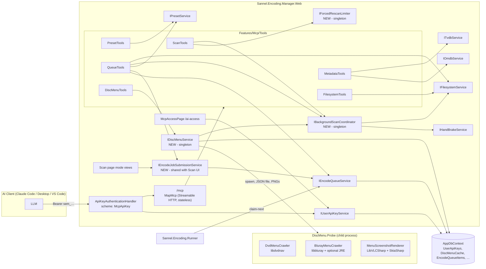
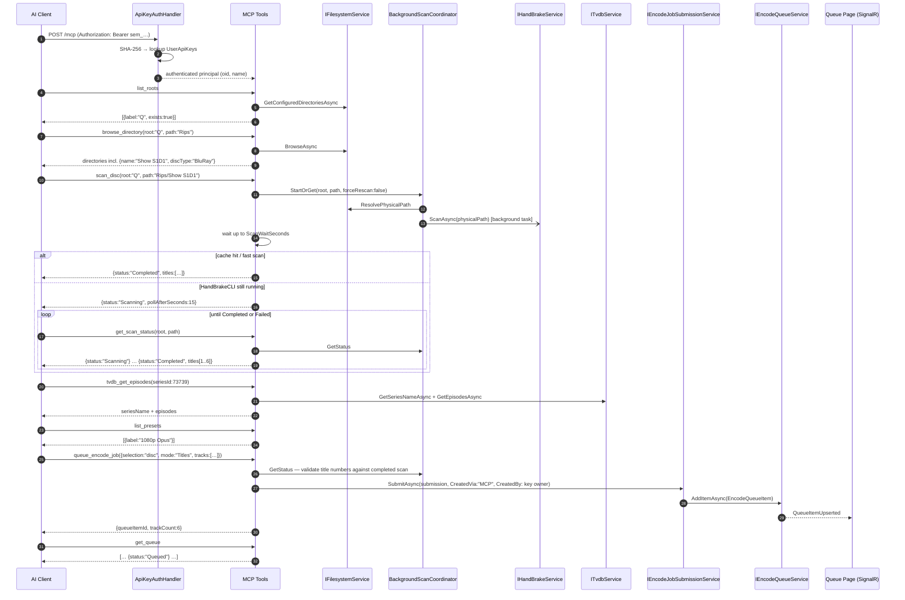
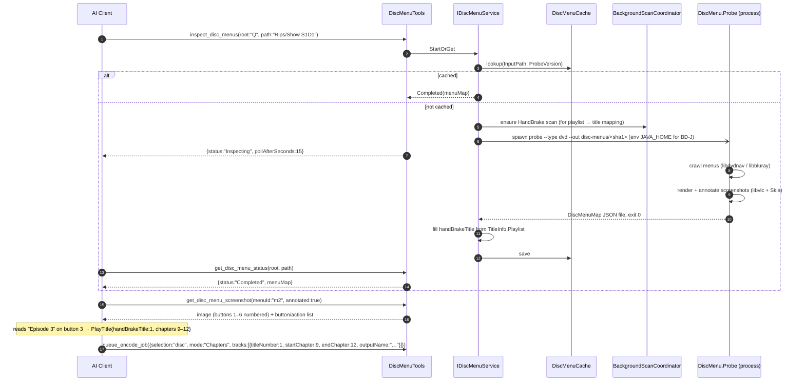
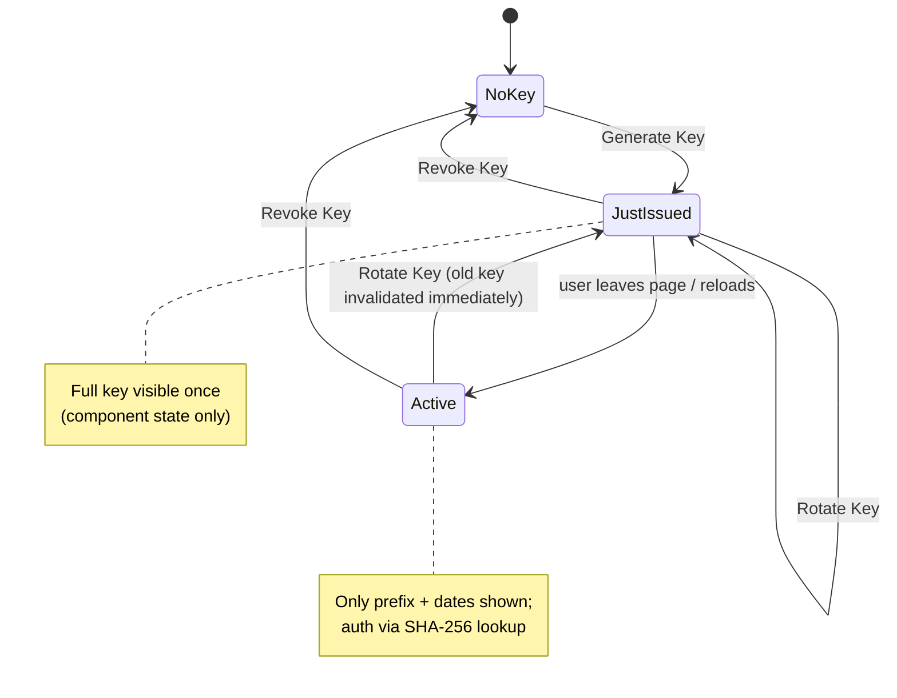
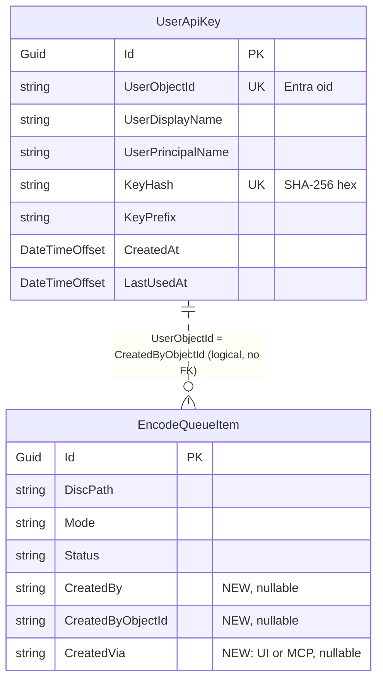

# MCP Server for Encoding Setup

## Overview

Today, setting up an encode is a manual click-through: pick a root and folder in the **Filesystem Browser**, land on the **Scan** page, choose a mode (Titles / Chapters / Movie / Files), look up names from TheTVDB or OMDb, pick a preset, and press **Add to Queue**. This plan adds a **Model Context Protocol (MCP) server** to the web app so an AI assistant (Claude Code, Claude Desktop, or any MCP client) can do the same workflow by calling tools: browse the configured roots, scan a disc or list folder files, resolve episode or movie names, and queue a fully configured encode job. Each signed-in user gets a **personal API key** that the MCP endpoint accepts. A new **AI Access** page lets the user generate, rotate, or revoke their key (the full key is shown only once) and gives copy-paste setup instructions for AI clients. Queue items now record who created them and whether they came from the UI or MCP.

The AI can also **inspect a disc's menus**. A sandboxed probe process walks the DVD or Blu-ray menu tree and records where each button leads: a submenu, title X, or title X chapters Y–Z. It also captures screenshots of every menu, with numbered button boxes drawn on them. The AI reads the screenshots ("Episode 3", "Play All", "Deleted Scenes") and matches each button to the title and chapter range it plays. It can then queue exactly those encodes. All discs are decrypted before this system sees them, so decryption is out of scope.

## Business Domain

Encoding Job Setup (Filesystem browse → Scan → Name → Queue), exposed through a new MCP interface.

## Goals

- An AI client can list the configured filesystem roots and browse directories, seeing disc-type detection (DVD / Blu-ray) and media files, which matches the Filesystem Browser.
- An AI client can do every selection the browser offers: **disc folder**, **folder of files** (recursive), and **single file**.
- An AI client can scan a disc with HandBrake (honouring the 24-hour scan cache, with an optional force-rescan) and read titles, durations, resolutions, chapters, audio, and subtitle tracks. Slow, uncached scans run in the background and the AI polls for the result, so no request has to stay open for minutes.
- An AI client can look up TVDB series and episodes (including cached series and episode order types) and search OMDb for movies.
- An AI client can list the available HandBrake presets.
- An AI client can queue an encode job in any mode the Scan page supports: TV Titles, Chapters (segments), Movie Titles, TV Files, and Movie Files. The job it creates is identical in shape to one created through the UI.
- An AI client can read the current queue (read-only) to confirm what it queued.
- Every signed-in user can generate their own API key on a new **AI Access** page. The full key is shown **once** (on generate or rotate), and after that only its prefix and usage dates are shown. The user can rotate or revoke it at any time. The page has step-by-step setup instructions for common AI clients.
- The MCP endpoint rejects requests without a valid, non-revoked key.
- Every queue item records **who** created it and **how** (`UI` or `MCP`), and the queue detail dialog shows this.
- Forced rescans through MCP are rate-limited for each key, so a runaway agent can't keep HandBrake busy.
- An AI client can inspect a DVD or Blu-ray menu tree and get:
    - every menu and submenu, with how to reach it from the root menu;
    - every button, with its on-screen rectangle and what it does: open a menu, play a title (with its HandBrake title number and chapter range), change a setting (audio, subtitles, angle), or unknown;
    - a screenshot of each menu, raw or annotated with numbered button boxes.
- DVD menus are mapped deterministically by running the disc's own navigation logic, including "Play All" versus single-episode buttons that depend on the disc's state.
- Blu-ray menus are mapped by pressing keys and watching what changes. That covers standard (HDMV) menus, and Java (BD-J) menus when a JRE is configured.
- Menu results are cached in the database, so repeat requests for the same disc are instant.
- Menu inspection works on Linux and Windows.

## Non-Goals

- Queue management through MCP (delete, cancel, retry, reorder, clear finished). That belongs to the Encoding Queue Management domain and can be a follow-up plan.
- Managing presets, settings, or runners through MCP.
- A stdio / local MCP transport. Only Streamable HTTP, hosted in the web app, is in scope.
- MCP OAuth / Entra ID token flow for MCP clients. The per-user API key is the only MCP auth mechanism.
- Multiple keys per user, key scopes, or key expiry.
- Restricting keys to an Entra app role or group. Any signed-in user can get a key, just as any signed-in user can use the UI today.
- General request rate limiting. Only forced rescans are limited.
- A configurable public base URL for the MCP endpoint. The setup snippets use the URL the user browsed to.
- Backfilling `CreatedBy` / `CreatedVia` for existing queue items. Those rows stay `null` and are shown as "Unknown".
- Changes to the Runner.
- Decrypting discs (CSS / AACS / BD+). Every disc is decrypted before the system sees it.
- Server-side OCR of menu text. The AI reads the screenshots itself.
- Showing menus in the web UI (for example a "Disc Menus" panel on the Scan page). This plan exposes them through MCP only.
- Guaranteed coverage of BD-J menus. Their logic is Java code, so the crawl is best-effort and bounded by time and state limits.

---

## Architecture / Design

### Affected Projects

| Project | Role |
|---|---|
| `Sannel.Encoding.Manager.Web` | Hosts the MCP endpoint (`/mcp`), MCP tool classes, API-key authentication handler, background scan coordinator, forced-rescan rate limiter, AI Access page, the extracted job-submission service shared by the Scan UI and MCP, and the "created by" display in the queue detail dialog. |
| `Sannel.Encoding.Manager.Data` | New `UserApiKey` and `DiscMenuCache` entities, new `CreatedBy` / `CreatedVia` columns on `EncodeQueueItem`, and `DbSet` / model configuration in `AppDbContext`. |
| `Sannel.Encoding.Manager.Migrations.Sqlite` | Migration `AddMcpSupport`. |
| `Sannel.Encoding.Manager.Migrations.Postgres` | Migration `AddMcpSupport`. **Both providers are required.** |
| `Sannel.Encoding.Manager.HandBrake` | `TitleInfo` gains `Playlist` (Blu-ray `.mpls` number, parsed from HandBrake's JSON) so Blu-ray menu targets can be mapped to HandBrake title numbers. `IProcessRunner` gains an optional environment-variables parameter, used to pass `JAVA_HOME` / `LIBBLURAY_CP` to the probe. |
| `Sannel.Encoding.Manager.DiscMenu` | **NEW** class library. The menu-map model (`DiscMenuMap`, `MenuNode`, `MenuButton`, `ButtonAction`), P/Invoke bindings for libdvdnav and libbluray, the DVD and Blu-ray crawlers, the libvlc screenshot renderer, and button annotation. It has no ASP.NET dependencies. |
| `Sannel.Encoding.Manager.DiscMenu.Probe` | **NEW** console app. Runs one crawl in its own process and writes the `DiscMenuMap` as JSON to the file named by `--json` and PNGs to an output folder. It's published next to the web app. |
| `tests/Sannel.Encoding.Manager.DiscMenu.Tests` | **NEW** unit tests for graph building, key-path computation, chapter-range folding, HandBrake title mapping, and annotation, using fake navigator interfaces. Native libraries aren't needed. |
| `src/Sannel.Encoding.Manager.Web/Dockerfile` | Install the native menu libraries in the final image (see Native dependencies). The probe is part of the publish output. |
| `Sannel.Encoding.Runner` | No changes. Jobs queued through MCP are ordinary `EncodeQueueItem` rows. |

### NuGet Packages

| Package | Version | Rationale |
|---|---|---|
| `ModelContextProtocol.AspNetCore` | 2.2.0 | Official C# MCP SDK (Microsoft + Anthropic). Provides `AddMcpServer()`, `WithHttpTransport()`, `MapMcp()`, and attribute-based tool discovery (`[McpServerToolType]`, `[McpServerTool]`). It pulls in `ModelContextProtocol` (the core) transitively. Tool methods support constructor/parameter DI, so the existing scoped services can be injected directly. |

| `LibVLCSharp` | 3.10.1 | The official .NET binding for libvlc (`Sannel.Encoding.Manager.DiscMenu`). It renders menus (MPEG-2 or H.264 video plus subpicture or IG overlays) into memory buffers through `SetVideoFormat` / `SetVideoCallbacks`, and replays recorded key paths with `MediaPlayer.Navigate`. It works headless, with no window or GPU. |
| `VideoLAN.LibVLC.Windows` | 3.0.24 | The native libvlc and plugins for Windows (`Probe` project, Windows RID only). On Linux, libvlc comes from the distro. |
| `SkiaSharp` | 4.153.1 | Encodes PNGs and draws the numbered button boxes on annotated screenshots. MIT-licensed. |
| `SkiaSharp.NativeAssets.Linux.NoDependencies` | 4.153.1 | The Skia native library for Linux and Docker, with no fontconfig dependency. |

Hashing uses `System.Security.Cryptography`, and rate limiting uses the built-in `System.Threading.RateLimiting` (part of the shared framework). libdvdnav and libbluray have no maintained .NET wrapper, so `Sannel.Encoding.Manager.DiscMenu` calls them through hand-written `[LibraryImport]` P/Invoke bindings. Only about 20 functions are needed (listed under Disc Menu Inspection).

### Native Dependencies

| Library | Purpose | Linux / Docker (Debian/Ubuntu packages) | Windows |
|---|---|---|---|
| libdvdnav + libdvdread | DVD navigation VM, menu buttons, title/part position | `libdvdnav4`, `libdvdread8` (Ubuntu 26.04: `libdvdread8t64`) | `libdvdnav-4.dll`, `libdvdread-8.dll` from MSYS2 (`mingw-w64-ucrt-x86_64-libdvdnav`), with their DLL dependencies, in `DiscMenu:NativeLibraryPath` |
| libbluray | Blu-ray navigation, events, overlays, key input, BD-J host | `libbluray2` (Debian 13), `libbluray3` (Ubuntu 26.04) | `libbluray-2.dll` from MSYS2 (`mingw-w64-ucrt-x86_64-libbluray`), with its dependencies (libxml2, freetype, …) |
| libbluray BD-J jar | Runs Java menus | `libbluray-bdj` (`/usr/share/java/libbluray-j2se-*.jar`) | The `libbluray-j2se-*.jar` from the same MSYS2 package or a libbluray release |
| JRE (optional) | Needed only for BD-J menus | Any JRE 8+, for example `openjdk-17-jre-headless` | Any JRE 8+. Point `DiscMenu:JavaHome` at it. |
| libvlc + plugins | Rendering menus for screenshots | `libvlc5`, `vlc-plugin-base` | From the `VideoLAN.LibVLC.Windows` NuGet package (bundled) |

VLC on Windows builds libdvdnav and libbluray into its own plugin DLLs, so they can't be reused from a VLC install. That's why separate MSYS2 builds are needed. The probe resolves library names through `NativeLibrary.SetDllImportResolver`: `dvdnav` maps to `libdvdnav.so.4` or `libdvdnav-4.dll`, searching `DiscMenu:NativeLibraryPath` first and then the OS default search path. On first use the web app checks that each library loads. When one is missing, the menu tools return a clear "not available on this host: missing libdvdnav" error instead of failing the probe.

### Feature Folder Structure

```
src/Sannel.Encoding.Manager.Data/
├── Features/Data/
│   └── AppDbContext.cs                     ← DbSet<UserApiKey>, DbSet<DiscMenuCache>, indexes
├── Features/Queue/Entities/
│   └── EncodeQueueItem.cs                  ← add CreatedBy, CreatedByObjectId, CreatedVia
├── Features/Mcp/Entities/
│   └── UserApiKey.cs                       ← NEW entity
└── Features/DiscMenu/Entities/
    └── DiscMenuCache.cs                    ← NEW entity

src/Sannel.Encoding.Manager.HandBrake/
├── TitleInfo.cs                            ← add int? Playlist
├── HandBrakeParser.cs                      ← parse "Playlist" from the JSON title list
└── IProcessRunner.cs / ProcessRunner.cs    ← optional environment variables

src/Sannel.Encoding.Manager.DiscMenu/       ← NEW class library
├── Model/
│   ├── DiscMenuMap.cs                      ← DiscType, MenuKind, menus, buttons, titles, warnings, limits hit
│   ├── MenuNode.cs                         ← id, kind, domain, reach path, buttons, screenshot names
│   ├── MenuButton.cs                       ← number, rect, neighbours, action
│   ├── ButtonAction.cs                     ← OpenMenu | PlayTitle | ChangeSetting | Unknown
│   └── NavKey.cs                           ← Up | Down | Left | Right | Enter | Menu | TopMenu | PopUp
├── Native/
│   ├── DvdNavNative.cs                     ← [LibraryImport] bindings for libdvdnav
│   ├── BlurayNative.cs                     ← [LibraryImport] bindings for libbluray
│   └── NativeLibraryResolver.cs            ← per-OS library names + NativeLibraryPath
├── Dvd/
│   ├── DvdVm.cs                            ← managed wrapper over a dvdnav handle / dvdnav_dup snapshot
│   └── DvdMenuCrawler.cs                   ← deterministic VM crawl
├── Bluray/
│   ├── BluraySession.cs                    ← one libbluray playback session: events, key input
│   ├── OverlayCompositor.cs                ← down-sampled IG / ARGB plane for fingerprinting
│   └── BlurayMenuCrawler.cs                ← key-press crawl over overlay states
├── CrawlOptions.cs
└── KeyPathPlanner.cs                       ← shortest arrow-key path to a button via neighbour links

src/Sannel.Encoding.Manager.DiscMenu.Probe/ ← NEW console app (the only project that references LibVLCSharp / SkiaSharp)
├── Program.cs                              ← probe --input <path> --type dvd|bluray --json <file> --out <dir> [limits…]
├── ProbeArguments.cs
└── Rendering/
    ├── MenuScreenshotRenderer.cs           ← LibVLCSharp: replay key path, capture frame
    └── ButtonAnnotator.cs                  ← SkiaSharp: numbered boxes (seven-segment digits; headless Skia has no fonts)

tests/Sannel.Encoding.Manager.DiscMenu.Tests/ ← NEW: key paths, JSON, title mapping, queue validation, limiter,
                                                 plus a libdvdnav integration test (DISC_MENU_TEST_DVD)

src/Sannel.Encoding.Manager.Web/
├── Program.cs                              ← register MCP server, auth scheme, policy, services; MapMcp
└── Features/
    ├── Mcp/                                ← NEW feature slice
    │   ├── Pages/
    │   │   ├── McpAccessPage.razor         ← @page "/ai-access"
    │   │   └── McpAccessPage.razor.cs
    │   ├── Components/
    │   │   ├── RotateKeyConfirmDialog.razor
    │   │   ├── RotateKeyConfirmDialog.razor.cs
    │   │   ├── NewKeyRevealCard.razor      ← one-time display of a freshly generated key
    │   │   ├── NewKeyRevealCard.razor.cs
    │   │   └── ClientSetupInstructions.razor   ← tabs with per-client snippets
    │   ├── Tools/                          ← MCP tool types (one class per tool group)
    │   │   ├── FilesystemTools.cs
    │   │   ├── ScanTools.cs
    │   │   ├── DiscMenuTools.cs            ← inspect_disc_menus, get_disc_menu_status, get_disc_menu_screenshot
    │   │   ├── MetadataTools.cs            ← TVDB + OMDb
    │   │   ├── PresetTools.cs
    │   │   └── QueueTools.cs
    │   ├── Dto/                            ← tool input/output shapes (LLM-friendly, flat)
    │   │   ├── McpRootDto.cs
    │   │   ├── McpBrowseResult.cs
    │   │   ├── McpScanResult.cs            ← status: Completed | Scanning | Failed (+ titles when completed)
    │   │   ├── McpTitleSummary.cs
    │   │   ├── McpChapterDto.cs
    │   │   ├── McpQueueEncodeRequest.cs
    │   │   ├── McpQueueTrack.cs
    │   │   ├── McpQueueEncodeResult.cs
    │   │   └── McpQueueItemSummary.cs
    │   ├── Authentication/
    │   │   ├── ApiKeyAuthenticationHandler.cs
    │   │   ├── ApiKeyAuthenticationOptions.cs
    │   │   └── ApiKeyDefaults.cs           ← scheme name "McpApiKey", policy "McpApi"
    │   ├── Services/
    │   │   ├── IUserApiKeyService.cs
    │   │   ├── UserApiKeyService.cs
    │   │   ├── IForcedRescanLimiter.cs
    │   │   └── ForcedRescanLimiter.cs      ← per-key sliding window (singleton)
    │   └── Options/
    │       └── McpOptions.cs               ← Enabled, ServerName, ForcedRescan limits, scan wait
    ├── Scan/
    │   ├── Services/                       ← NEW folder
    │   │   ├── IEncodeJobSubmissionService.cs
    │   │   ├── EncodeJobSubmissionService.cs
    │   │   ├── IBackgroundScanCoordinator.cs
    │   │   └── BackgroundScanCoordinator.cs    ← singleton; de-duplicates in-flight scans
    │   ├── Dto/
    │   │   ├── EncodeJobSubmission.cs      ← NEW: input for the submission service
    │   │   └── ScanJobStatus.cs            ← NEW: Scanning | Completed | Failed + result
    │   └── Components/
    │       └── NamingComponentBase.cs      ← AddDiskToQueueAsync delegates to the new service, passes current user
    ├── DiscMenu/                           ← NEW feature slice
    │   ├── Services/
    │   │   ├── IDiscMenuService.cs         ← cache lookup + start/poll probe
    │   │   ├── DiscMenuService.cs          ← singleton coordinator; de-duplicates in-flight probes
    │   │   ├── IDiscMenuProbeRunner.cs
    │   │   └── DiscMenuProbeRunner.cs      ← launches the probe through IProcessRunner with env + timeout
    │   ├── Dto/
    │   │   └── DiscMenuJobStatus.cs        ← Inspecting | Completed | Failed | Unavailable + map
    │   └── Options/
    │       └── DiscMenuOptions.cs          ← JavaHome, LibBlurayJarPath, NativeLibraryPath, limits, …
    ├── Queue/
    │   └── Components/
    │       └── QueueDetailDialog.razor     ← show "Created by {CreatedBy} via {CreatedVia}"
    └── Shared/Layout/
        └── NavMenu.razor                   ← add "AI Access" link
```

### Data Model Changes

**New entity `UserApiKey`** (`Sannel.Encoding.Manager.Data/Features/Mcp/Entities/UserApiKey.cs`, namespace `Sannel.Encoding.Manager.Web.Features.Mcp.Entities`, matching the existing Data-project convention):

| Property | Type | Notes |
|---|---|---|
| `Id` | `Guid` | PK |
| `UserObjectId` | `string` | Entra `oid` claim (stable per user per tenant). **Unique index.** This gives one active key per user. |
| `UserDisplayName` | `string?` | `name` claim, refreshed on each page visit. Shown in logs and audit. |
| `UserPrincipalName` | `string?` | `preferred_username` claim, for the MCP principal. |
| `KeyHash` | `string` | Hex SHA-256 of the full key. **Unique index.** Used for O(1) lookup during authentication. |
| `KeyPrefix` | `string` | First 8 characters (for example `sem_Ab12`), shown on the AI Access page and in logs. |
| `CreatedAt` | `DateTimeOffset` | Set on create/rotate. |
| `LastUsedAt` | `DateTimeOffset?` | Updated on successful auth (throttled, for example at most once per minute). |

`AppDbContext` gets `DbSet<UserApiKey> UserApiKeys` plus `HasKey(Id)` and the two unique indexes.

**Key format:** `sem_` + 32 random bytes from `RandomNumberGenerator`, base64url-encoded (about 47 characters). The prefix makes leaked keys easy to recognise in secret scanners.

**Hash only, never the plaintext.** The full key exists only in memory long enough to hash it and show it to the user once. A database leak doesn't reveal usable keys. A plain SHA-256 is enough because the key has 256 bits of entropy (no salt or slow KDF is needed, unlike passwords). A user who loses their key rotates it.

**Modified entity `EncodeQueueItem`:**

| Property | Type | Notes |
|---|---|---|
| `CreatedBy` | `string?` | Display name of the creator (`name` claim, falling back to `preferred_username`). `null` for rows that existed before this migration. |
| `CreatedByObjectId` | `string?` | Entra `oid` of the creator, for a stable identity if the display name changes. |
| `CreatedVia` | `string?` | `"UI"` or `"MCP"`. `null` for older rows. |

**New entity `DiscMenuCache`** (`Sannel.Encoding.Manager.Data/Features/DiscMenu/Entities/DiscMenuCache.cs`):

| Property | Type | Notes |
|---|---|---|
| `InputPath` | `string` | PK. The full physical disc path, the same key style as `DiscScanCache`. |
| `DiscType` | `string` | `DVD` or `BluRay` |
| `MenuJson` | `string` | The serialized `DiscMenuMap` returned by the probe |
| `ScreenshotFolder` | `string` | A folder under `DiscMenu:OutputPath`, named by the SHA-1 of `InputPath`, holding `menu-<id>.png` and `menu-<id>-annotated.png` |
| `ProbeVersion` | `int` | The probe's model version. A row with an older version is treated as a cache miss, so crawler improvements re-probe automatically. |
| `CachedAt` | `DateTimeOffset` | |

There's no time-based expiry, because a disc's menus don't change. `forceRefresh` or a `ProbeVersion` bump replaces the row and its screenshot folder.

> ⚠️ One migration, `AddMcpSupport`, covers all three changes (`UserApiKeys`, `DiscMenuCache`, the `EncodeQueueItems` columns). It is required for **both** providers:
> ```pwsh
> dotnet ef migrations add AddMcpSupport --project src/Sannel.Encoding.Manager.Migrations.Sqlite/Sannel.Encoding.Manager.Migrations.Sqlite.csproj --output-dir Migrations --namespace Sannel.Encoding.Manager.Migrations.Sqlite.Migrations
> dotnet ef migrations add AddMcpSupport --project src/Sannel.Encoding.Manager.Migrations.Postgres/Sannel.Encoding.Manager.Migrations.Postgres.csproj --output-dir Migrations --namespace Sannel.Encoding.Manager.Migrations.Postgres.Migrations
> ```

### API / Controller Changes

No new REST controllers. A single new endpoint is mapped by the MCP SDK:

| Method | Route | Description |
|---|---|---|
| `POST` / `GET` / `DELETE` | `/mcp` | MCP Streamable HTTP transport. `app.MapMcp("/mcp").RequireAuthorization("McpApi")`. |

The transport runs in **stateless** mode (`WithHttpTransport(o => o.Stateless = true)`). No tool depends on server-side session state, and stateless mode avoids sticky-session issues behind a reverse proxy.

Pipeline adjustments in `Program.cs`:
- Add `/mcp` to the existing `UseWhen` exclusion (next to `/api` and `/hubs`) so 401/404 aren't re-executed into the Blazor not-found page.
- Add `/mcp` to the cookie `OnRedirectToLogin` / `OnRedirectToAccessDenied` path checks, returning 401/403 instead of redirecting to Entra.
- Exempt `/mcp` from antiforgery (the MCP SDK endpoints are not form posts. Confirm during implementation that `MapMcp` does not require `DisableAntiforgery()`).

#### Authentication

A new `ApiKeyAuthenticationHandler : AuthenticationHandler<ApiKeyAuthenticationOptions>`, registered as scheme `McpApiKey`:

```
HandleAuthenticateAsync():
    key = header "Authorization: Bearer <key>"  OR  header "X-Api-Key: <key>"
    if key missing or not starting with "sem_" → NoResult
    record = UserApiKeyService.FindByKeyAsync(key)     // SHA-256 → indexed lookup, constant-time compare
    if record is null → Fail("Invalid API key")
    touch LastUsedAt (throttled)
    principal claims: oid = record.UserObjectId, name = record.UserDisplayName,
                      preferred_username = record.UserPrincipalName, auth_method = "mcp_api_key"
    → Success(ticket)
```

Authorization policy `McpApi`: `AddAuthenticationSchemes("McpApiKey").RequireAuthenticatedUser()`. The scheme is only used on `/mcp`, so it doesn't widen access to the Blazor UI, `/api/*`, or the hubs.

### Service Layer

#### 1. `IUserApiKeyService` (new, scoped)

```
Task<UserApiKeyInfo?>   GetForUserAsync(string userObjectId, ct)        // metadata only; null if none
Task<GeneratedApiKey>   CreateOrRotateAsync(ClaimsPrincipal user, ct)   // replaces any existing key atomically
Task<bool>              RevokeAsync(string userObjectId, ct)
Task<UserApiKey?>       FindByKeyAsync(string rawKey, ct)               // used by the auth handler
Task                    TouchLastUsedAsync(Guid id, ct)

UserApiKeyInfo  { string KeyPrefix, DateTimeOffset CreatedAt, DateTimeOffset? LastUsedAt }
GeneratedApiKey { string Key /* plaintext, returned once, never stored */, UserApiKeyInfo Info }
```

#### 2. `IEncodeJobSubmissionService` (new, scoped). Extracted from `NamingComponentBase.AddDiskToQueueAsync`

The queue-building rules live in a Blazor base component today. They are moved into a service so the UI and MCP produce identical jobs:

```
Task<EncodeJobSubmissionResult> SubmitAsync(EncodeJobSubmission submission, ct)

EncodeJobSubmission {
    string  RootLabel
    string  DiscPath            // root-relative, forward slashes (folder for Files mode, disc folder for Titles/Chapters)
    string  Mode                // "Titles" | "Chapters" | "Files"
    string? PresetLabel
    int?    TvdbId
    string? TvdbShowName
    IReadOnlyList<EncodeTrackConfig> Tracks
    string? CreatedBy             // display name from the current principal
    string? CreatedByObjectId     // oid from the current principal
    string  CreatedVia            // "UI" | "MCP"
}

SubmitAsync:
    drop tracks whose OutputName is blank
    if none remain → return Rejected("No tracks with names")
    stamp PresetLabel on every track
    AudioDefault ← SettingsService.GetSettingsAsync().AudioDefault
    build EncodeQueueItem (DiscRootLabel = RootLabel, TracksJson = serialize(tracks),
                           CreatedBy, CreatedByObjectId, CreatedVia, …)
    EncodeQueueService.AddItemAsync(item)      // existing: SortOrder, SignalR notify
    return Accepted(item.Id, trackCount)
```

`NamingComponentBase.AddDiskToQueueAsync` keeps its signature but delegates to this service and maps the result to the existing snackbar messages. It reads the signed-in user from the cascading `Task<AuthenticationState>` (already enabled via `AddCascadingAuthenticationState()`) and passes `CreatedVia = "UI"`. The MCP tool passes the API-key principal's claims and `CreatedVia = "MCP"`. There is no other visible change in the Scan UI.

#### 3. `IBackgroundScanCoordinator` (new, singleton)

Handles slow HandBrake scans without keeping an MCP request open for minutes:

```
ScanJobStatus StartOrGet(string rootLabel, string relativePath, bool forceRescan)
ScanJobStatus? GetStatus(string rootLabel, string relativePath)

ScanJobStatus { State: Scanning | Completed | Failed, StartedAt, CompletedAt?, Result: HandBrakeScanResult?, Error: string? }

StartOrGet:
    physical = FilesystemService.ResolvePhysicalPath(root, path)    // traversal guard
    if an in-flight scan exists for physical → return its status     // de-duplicates concurrent callers
    if forceRescan is false and a completed entry is held in memory → return it
    start Task.Run(() => HandBrakeService.ScanAsync(physical, forceRescan, appStoppingToken))
    store it in ConcurrentDictionary<string physicalPath, Entry>
    return Scanning

Entries are evicted 30 minutes after they complete. After that, the 24-hour DiscScanCache still makes a repeat scan fast.
```

The scan runs on the application-stopping token, not the request token, so it survives the MCP request that started it. `IHandBrakeService` is already a singleton, so no scope is needed.

#### 4. `IForcedRescanLimiter` (new, singleton)

A sliding-window limiter for each key, built on `System.Threading.RateLimiting.SlidingWindowRateLimiter` in a `ConcurrentDictionary<Guid keyId, RateLimiter>`. Default: **3 forced rescans per key per 10 minutes** (configurable in `McpOptions`). Only `scan_disc` with `forceRescan: true` uses a permit. When it's exhausted, the tool returns an `isError` result that says when the next forced rescan is allowed, and suggests using the cached result instead. Non-forced scans and all other tools aren't limited.

#### 5. MCP tool validation layer (inside `QueueTools`)

The UI only offers valid choices, but an AI can send anything, so `queue_encode_job` validates before calling the submission service:

| Check | Source of truth |
|---|---|
| `root` is a configured label; `path` stays inside the root | `IFilesystemService.ResolvePhysicalPath` (existing traversal guard) |
| Disc modes: every `titleNumber` exists in the scan | Completed result from `IBackgroundScanCoordinator` (or the 24-hour cache). If the disc hasn't been scanned yet, the tool returns an error telling the AI to call `scan_disc` first. |
| Chapters mode: `startChapter ≤ endChapter`, both within the title's chapter range | Scan result |
| Files mode: every `sourceRelativePath` is in the folder's recursive media listing | `IFilesystemService.GetMediaFilesRecursiveAsync` |
| `presetLabel` (if supplied) matches an existing preset | `IPresetService.GetPresetsAsync` |
| `outputName` contains no path separators or invalid filename characters | `Path.GetInvalidFileNameChars()` |
| `resolution` (if supplied) is one of the allowed values | `ResolutionDetector.GetAvailableResolutions()` |

Validation failures return a structured MCP tool error (`isError: true`) that lists *all* problems, so the AI can fix and retry in a single round trip.

#### 6. MCP tools

All tools are thin adapters over the existing services. Tool names use `snake_case`, and descriptions are written for an LLM audience.

| Tool | Parameters | Returns | Backed by |
|---|---|---|---|
| `list_roots` | none | `[{ label, exists }]` | `IFilesystemService.GetConfiguredDirectoriesAsync` |
| `browse_directory` | `root`, `path?` | `{ path, directories:[{ name, discType }], files:[{ name, sizeBytes }] }` | `BrowseAsync` |
| `list_folder_media_files` | `root`, `path?` | `[{ relativePath, name, sizeBytes }]` sorted like the UI | `GetMediaFilesRecursiveAsync` |
| `scan_disc` | `root`, `path`, `forceRescan=false`, `minimumDurationSeconds=30` | `{ status:"Completed", inputPath, titles:[{ titleNumber, duration, width, height, detectedResolution, frameRate, chapterCount, audioTracks:[…], subtitles:[…] }] }` **or** `{ status:"Scanning", startedAt, pollAfterSeconds:15 }` **or** `{ status:"Failed", error }` | `IBackgroundScanCoordinator.StartOrGet`, waiting up to `McpOptions.ScanWaitSeconds` (default 5) so cache hits return straight away. `forceRescan` uses a permit from `IForcedRescanLimiter`. |
| `get_scan_status` | `root`, `path`, `minimumDurationSeconds=30` | Same shape as `scan_disc`. Returns an error if no scan was started for that path. | `IBackgroundScanCoordinator.GetStatus` |
| `get_title_chapters` | `root`, `path`, `titleNumber`, `chaptersPerSegment=1` | `[{ segment, startChapter, endChapter, duration }]` (same chunking as `ChaptersModeView`) | Completed scan result |
| `inspect_disc_menus` | `root`, `path`, `forceRefresh=false` (rate-limited like forced rescans) | `{ status:"Completed", menuMap }` **or** `{ status:"Inspecting", pollAfterSeconds:15 }` **or** `{ status:"Failed" \| "Unavailable", error }`. See Disc Menu Inspection for the `menuMap` shape. | `IDiscMenuService.StartOrGet` (DB cache → probe), waiting up to `ScanWaitSeconds` |
| `get_disc_menu_status` | `root`, `path` | Same shape as `inspect_disc_menus` | `IDiscMenuService.GetStatus` |
| `get_disc_menu_screenshot` | `root`, `path`, `menuId`, `annotated=true` | An MCP **image content** block (PNG, at most `ScreenshotWidth` pixels wide) plus a text block listing the button numbers and actions | Cached screenshot files |
| `tvdb_list_cached_series` | none | `[{ seriesId, name }]` | `ITvdbService.GetCachedSeriesAsync` |
| `tvdb_get_episodes` | `seriesId`, `orderType=Default` | `{ seriesName, episodes:[{ season, episode, name }] }` | `GetSeriesNameAsync` + `GetEpisodesAsync` |
| `omdb_search_movie` | `title` | `{ title, year, genres, imdbId }` or not-found; error if OMDb not configured | `IOmdbService` |
| `list_presets` | none | `[{ label, presetName }]` | `IPresetService.GetPresetsAsync` |
| `list_resolutions` | none | `["480p","720p","1080p","4k",…]` | `ResolutionDetector` |
| `queue_encode_job` | `McpQueueEncodeRequest` (below) | `{ queueItemId, trackCount, skippedTracks }` | Validation + `IEncodeJobSubmissionService` |
| `get_queue` | `includeFinished=false` | `[{ id, discPath, rootLabel, mode, status, progressPercent, trackCount, createdAt, createdBy, createdVia }]` | `IEncodeQueueService.GetItemsAsync` (read-only) |

`McpQueueEncodeRequest`:

```
{
  root:          string                  // configured root label
  path:          string?                 // disc folder, media folder, or single file (root-relative)
  selection:     "disc" | "folder" | "file"
  mode:          "Titles" | "Chapters"   // required for selection = disc; ignored otherwise ("Files")
  presetLabel:   string?
  tvdbSeriesId:  int?                    // server resolves TvdbShowName from TVDB
  movieYear:     string?                 // applied to all tracks when set (movie jobs)
  tracks: [{
      titleNumber:        int?           // disc modes
      startChapter:       int?           // Chapters mode
      endChapter:         int?           // Chapters mode
      sourceRelativePath: string?        // folder/file modes, relative to the folder
      outputName:         string         // blank = skip (same as UI)
      seasonNumber:       int?
      episodeNumber:      int?
      resolution:         string?        // movie jobs; omit for TV
  }]
}
```

How the selection maps onto a job matches the UI exactly:

| `selection` | `DiscPath` | `Mode` | Track source |
|---|---|---|---|
| `disc` | `path` | `Titles` or `Chapters` | `titleNumber` (+ chapters) |
| `folder` | `path` (or empty for root) | `Files` | `sourceRelativePath`, `TitleNumber = 1` |
| `file` | parent directory of `path` | `Files` | single track, `sourceRelativePath` = file name, `TitleNumber = 1` |

The TV vs. Movie distinction stays implicit, as in the UI: movie jobs set `movieYear` / `resolution` and leave season/episode empty.

**Server instructions.** `AddMcpServer(o => o.ServerInstructions = …)` supplies a short workflow guide for the AI: *list_roots → browse_directory → (scan_disc → poll get_scan_status while "Scanning" | list_folder_media_files) → for discs, inspect_disc_menus → get_disc_menu_screenshot for each relevant menu, to read button labels and map them to titles and chapter ranges → look up names (tvdb_* / omdb_search_movie) → list_presets → queue_encode_job → get_queue*. It also covers naming conventions (episode names come from TVDB, movies use the OMDb title, the year goes in `movieYear`, and blank output names are skipped). It says to avoid `forceRescan` unless the user asks for it, because it's rate-limited.

**Long scans.** An uncached HandBrake scan of a Blu-ray can take minutes, which could exceed a reverse proxy's idle timeout. `scan_disc` never blocks for more than `ScanWaitSeconds`. If the scan isn't done by then, it returns `status:"Scanning"` with a suggested `pollAfterSeconds`, and the AI polls `get_scan_status`. When two clients (or a client and the Scan page) scan the same disc, they share one in-flight scan.

#### 7. `McpOptions` (config section `Mcp`)

```
Enabled                       bool   = true    // when false, MapMcp is skipped and the AI Access page shows "disabled"
ServerName                    string = "sannel-encoding-manager"
ScanWaitSeconds               int    = 5       // how long scan_disc waits before returning "Scanning"
ForcedRescanPermitLimit       int    = 3
ForcedRescanWindowMinutes     int    = 10
```

The URL in the setup snippets always comes from `NavigationManager.BaseUri` (the URL the user browsed to). There is no config override.

### Disc Menu Inspection

Inspection produces a **`DiscMenuMap`**: a graph of menus, each with its buttons, and each button's action resolved to a submenu, a title and chapter range, a setting, or unknown. Screenshots give the AI the words the buttons show.

#### Why a separate probe process

The web app never loads libdvdnav, libbluray, libvlc or a JVM itself. `DiscMenuProbeRunner` starts `Sannel.Encoding.Manager.DiscMenu.Probe` through `IProcessRunner` for each disc, for four reasons:

1. A JVM can be created only once per process (a JNI limitation), and BD-J needs a fresh one for each disc.
2. libbluray reads `JAVA_HOME` and `LIBBLURAY_CP` from the process environment when it starts Java, so they're set on the child process from `DiscMenu:JavaHome` / `DiscMenu:LibBlurayJarPath`. The .NET `Environment` API can't reliably set native env vars after startup.
3. A crash in native code (a malformed IFO, or JVM aborts) kills only the probe.
4. A hard timeout (`ProbeTimeoutSeconds`) kills the whole process tree.

Probe contract:

```
probe --input <physical disc path> --type dvd|bluray --json <map file> --out <screenshot folder>
      [--no-screenshots] [--max-menus 64] [--max-actions 500] [--time-budget 240]
      [--menu-language en] [--screenshot-width 960] [--settle-ms 1500]
      [--native-path <dir>]
--json: the DiscMenuMap (schema version = ProbeVersion). Not stdout: libdvdread prints banners there.
stderr: diagnostics (logged by the web app at Debug)
exit 0 = map written (it may contain warnings) · 2 = unsupported / library missing · 1 = failure
```

#### Output model (`DiscMenuMap`, returned to the AI)

```
{
  discType: "DVD" | "BluRay",
  probeVersion: 1,
  menuSystem: "DVD" | "HDMV" | "BD-J" | "None",
  complete: bool,                         // false = a limit was hit; see warnings
  warnings: ["BD-J menu: JRE not configured (DiscMenu:JavaHome)", …],
  firstPlay: { action },                  // what the disc does on insert
  menus: [{
    id: "m3",                             // stable within this map
    kind: "Root" | "Title" | "Chapter" | "Audio" | "Subtitle" | "Angle" | "PopUp" | "Other",
    reachPath: ["TopMenu", "Down", "Down", "Enter"],   // key presses from disc start
    parentMenuId: "m0",
    screenshot: { available: bool, width, height },
    buttons: [{
      number: 4,                          // shown on the annotated screenshot
      rect: { x, y, w, h },               // in screenshot pixels
      neighbours: { up: 3, down: 5, left: null, right: null },  // DVD and HDMV only
      action:
        { type: "OpenMenu", menuId: "m5" }
      | { type: "PlayTitle",
          handBrakeTitle: 3,              // matches scan_disc titleNumber
          dvdTitle: 3, playlist: null,    // DVD: VTS_TT number · BD: mpls number
          startChapter: 5, endChapter: 8, // endChapter null = plays to the title's end
          then: "ReturnToMenu m3" | "End" | "Continue",
          confidence: "Exact" | "Observed" | "Inferred" }
      | { type: "ChangeSetting", setting: "Audio" | "Subtitle" | "Angle", value?: "…" }
      | { type: "Unknown", reason }
    }]
  }],
  titles: [{ handBrakeTitle, dvdTitle?, playlist?, chapterCount, duration,
             reachedFromButtons: ["m3#4", "m5#1"] }]   // reverse index for the AI
}
```

When the AI matches "Episode 3" on menu `m5` button 2 to `{ handBrakeTitle: 1, startChapter: 9, endChapter: 12 }`, it queues a `Chapters` job with that range. When it matches "Episode 3" to `{ handBrakeTitle: 4 }` with no chapter range, it queues a `Titles` job.

#### DVD crawl (libdvdnav, deterministic)

libdvdnav runs the DVD's own virtual machine (registers, pre/post/cell commands, button commands) without decoding video, so stepping through menus is cheap.

Bindings used: `dvdnav_open`, `dvdnav_close`, `dvdnav_reset`, `dvdnav_set_readahead_flag`, `dvdnav_menu_language_select`, `dvdnav_get_next_block`, `dvdnav_free_cache_block`, `dvdnav_current_title_info`, `dvdnav_current_title_program`, `dvdnav_is_domain_vmgm` / `_vtsm` / `_vts` / `_fp`, `dvdnav_get_current_nav_pci`, `dvdnav_get_current_highlight`, `dvdnav_button_select`, `dvdnav_button_activate`, `dvdnav_get_highlight_area`, `dvdnav_menu_call`, `dvdnav_still_skip`, `dvdnav_wait_skip`, `dvdnav_sector_search`, `dvdnav_get_position`, `dvdnav_describe_title_chapters`, `dvdnav_get_number_of_titles`, `dvdnav_get_number_of_parts`.

```
Start(vm): reset → step blocks, skipping STILL/WAIT events, until NAV_PACKET in a menu domain with
           button count > 0 (a menu), or the VTS title domain (first-play went straight into a title →
           record firstPlay, then menu_call(Root) and continue).

MenuKey(vm) = (domain, vtsN, pgcN, cellN, hash of the button table in the PCI)
              // the same PGC can show different buttons, so the button-table hash is part of the key

BFS from the first menu (queue of (menuKey, keyPathFromStart)):
  for each button b in the menu's PCI:
      vm = Replay(path)                  // libdvdnav has no state snapshot, so replay from the start (cheap, no decoding)
      button_select(b); button_activate(b)
      Run(vm) until one of:
        · a menu with buttons      → action OpenMenu(that menu); enqueue it if new
        · the VTS title domain     → FollowTitle(vm) → PlayTitle(…)
        · same menu, register change only (audio/sub stream set) → ChangeSetting
        · no progress after N blocks / a loop → Unknown("no navigation")
      stop at maxMenus / maxActions / time budget → complete = false + warning

FollowTitle(vm):                         // learns the END chapter cheaply
  record (title, startPart) from current_title_info
  loop:
    seek to the last sector of the current cell (sector_search), and read until the cell changes,
    so the cell/post commands run without reading the whole VOB
    current_title_info → if still the same title: endPart = part
    if the domain becomes a menu → then = "ReturnToMenu <id>"; stop
    if the title changes or the VM stops → then = "Continue" / "End"; stop
  confidence = Exact

Key paths: the reachPath for each menu = keys from disc start. Reaching button b = KeyPathPlanner's BFS over
the PCI neighbour links (up/down/left/right) from the menu's default highlighted button, then Enter.
These are the same keys the libvlc renderer replays.
```

`dvdTitle` (the global title number from `dvdnav_current_title_info`) equals HandBrake's DVD title index, so `handBrakeTitle = dvdTitle`. The probe cross-checks this against the title durations from `dvdnav_describe_title_chapters`, and adds a warning on any mismatch.

#### Blu-ray crawl (libbluray, observed)

libbluray's public API doesn't expose the IG button table, so Blu-ray menus are crawled from outside: press keys and watch the events and overlay changes. The same crawler serves HDMV and BD-J.

Bindings used: `bd_open`, `bd_close`, `bd_get_disc_info` (`bdj_detected`, `num_hdmv_titles`, `num_bdj_titles`, `first_play_supported`, `top_menu_supported`, title types), `bd_get_titles`, `bd_get_title_info` / `bd_free_title_info` (playlist number, duration, chapters), `bd_set_player_setting` (menu language; region), `bd_play`, `bd_menu_call`, `bd_read_ext` (with events), `bd_get_event`, `bd_user_input`, `bd_mouse_select`, `bd_register_overlay_proc` (HDMV IG/PG overlays) and `bd_register_argb_overlay_proc` (BD-J), `bd_seek_chapter`, `bd_seek`, `bd_tell`, `bd_get_current_title`, `bd_get_current_chapter`.

```
Overlay state = hash of the composited overlay planes after the overlay callbacks settle
                (no new draw for settleMs). A state with a MENU event active is a menu state.

Start: bd_play() → read with events until BD_EVENT_MENU(1), or a PLAYLIST event with no menu
       (first play went straight into content → record firstPlay → bd_menu_call → continue).

Focus discovery for each menu: press Up/Down/Left/Right from the default focus and record each new
       overlay state. The overlay rects that changed between two states = the focused button's rect.
       Repeat as a BFS over (menu, focus state) until no new focus states appear. This yields the buttons,
       their rects and the neighbour graph. HDMV only: bd_mouse_select(center of rect) confirms the button
       and gives an exact selection.

Activation: replay the path to (menu, focus) and press Enter, then read until:
  · BD_EVENT_MENU with a new overlay state not seen before → OpenMenu (new menu)
  · BD_EVENT_PLAYLIST p (+ PLAYITEM / CHAPTER c) with the menu hidden → PlayTitle(playlist p, start c)
      FollowPlaylist: bd_seek_chapter to the next chapters / near the end and read on, watching
      CHAPTER, PLAYLIST and MENU events, to find the end chapter and the "then" behaviour;
      confidence = Observed (HDMV) / Inferred (BD-J, when Java logic ends playback early)
  · the overlay changes but there's no playlist / menu change → ChangeSetting or a sub-state → Unknown("state change only")
  · nothing within settleMs × 4 → Unknown("no reaction")

BD-J: needs JAVA_HOME (DiscMenu:JavaHome) and the libbluray-j2se jar (LIBBLURAY_CP). Without them
      bd_get_disc_info reports bdj_detected && !bdj_handled → menuSystem = "BD-J", complete = false,
      warning "JRE not configured". The static data (titles → playlists, durations, chapters) is
      still returned, so the AI isn't left empty-handed.
```

The playlist to HandBrake title mapping uses the new `TitleInfo.Playlist`, parsed from HandBrake's JSON scan. The probe returns `playlist`, and the web app fills in `handBrakeTitle` after the map comes back, using the disc's cached HandBrake scan. If the disc hasn't been scanned, `inspect_disc_menus` starts a background scan first, so `handBrakeTitle` is always filled when it can be.

#### Screenshots (LibVLCSharp)

```
for each menu m:
   libvlc: new Media("dvd:///<path>" | "bluray:///<path>"), options :no-audio :no-spu-autoload? (keep spu)
   SetVideoFormat("RV32", w, h, pitch) + SetVideoCallbacks(lock → our buffer, unlock, display → latest frame)
   Play → wait until the first menu is shown (frames stop changing for settleMs, or vout+title events)
   replay m.reachPath with MediaPlayer.Navigate(Up/Down/Left/Right/Activate/Popup) or the TopMenu key,
   waiting settleMs after each key
   capture the latest frame → resize to ScreenshotWidth → menu-<id>.png
   ButtonAnnotator: draw each button rect (scaled) with a 2px outline and a numbered badge → menu-<id>-annotated.png
```

One libvlc instance is created per probe run, with `--no-audio --intf=dummy --no-video-title-show --vout=vmem` (via callbacks) and `--no-xlib` on Linux. BD-J screenshots use the same `JAVA_HOME` / `LIBBLURAY_CP` environment, since libvlc's bluray module wraps libbluray. If a frame can't be captured, `screenshot.available = false` and a warning is added. The menu map itself is still returned.

#### `IDiscMenuService` (web app, singleton)

```
DiscMenuJobStatus StartOrGet(rootLabel, relativePath, bool forceRefresh, TimeSpan maxWait)
DiscMenuJobStatus? GetStatus(rootLabel, relativePath)
Task<(byte[] png, MenuNode node)?> GetScreenshotAsync(rootLabel, relativePath, menuId, bool annotated)

StartOrGet:
    physical = ResolvePhysicalPath (traversal guard); discType = detect (VIDEO_TS / BDMV), else error
    !forceRefresh and a DiscMenuCache row with the current ProbeVersion → Completed
    in-flight probe for physical → its status
    libraries unavailable on this host (checked once at startup) → Unavailable(reason)
    start Task.Run: ensure a HandBrake scan (BackgroundScanCoordinator) → run probe →
                    fill handBrakeTitle from playlists → save DiscMenuCache + screenshots → Completed
```

Concurrency: at most `MaxConcurrentProbes` (default 1) probes run at once, through a `SemaphoreSlim`. Others wait in the `Inspecting` state.

#### `DiscMenuOptions` (config section `DiscMenu`)

```
Enabled                 bool    = true
JavaHome                string? = null    // JRE root for BD-J menus; null = BD-J menus not crawled
LibBlurayJarPath        string? = null    // libbluray-j2se-*.jar; null = auto-detect (/usr/share/java on Linux, next to libbluray-2.dll on Windows)
NativeLibraryPath       string? = null    // folder with libdvdnav/libdvdread/libbluray (required on Windows)
ProbePath               string? = null    // override the probe's location; default = next to the web app
OutputPath              string  = "disc-menus"   // screenshot root, relative to ContentRootPath
ProbeTimeoutSeconds     int     = 300
MaxConcurrentProbes     int     = 1
MaxMenus                int     = 64
MaxActions              int     = 500
TimeBudgetSeconds       int     = 240
MenuLanguage            string  = "en"
ScreenshotWidth         int     = 960
SettleMilliseconds      int     = 1500
```

`JavaHome` is a config setting, like `HandBrake:ExecutablePath`, so it can live in `appsettings.json`, environment variables (`DiscMenu__JavaHome`), or the encrypted `config/appsettings.json`.

### UI Changes

**New page `McpAccessPage`** at `/ai-access`, titled "AI Access". It's in `Features/Mcp/Pages/`, uses `@rendermode InteractiveServer`, and has a code-behind.

- **Endpoint card** (`MudCard`): the MCP URL (`{NavigationManager.BaseUri}mcp`) in a read-only `MudTextField` with a copy `MudIconButton`.
- **Your API Key card** (`MudCard`):
  - If no key: a `MudAlert` (Info) "You don't have an API key yet." and a `MudButton` **Generate Key**.
  - If a key exists: `MudText` shows the prefix in masked form (`sem_Ab12••••••••`), *Created …*, and *Last used …* (or "Never"). The full key is **not** available.
  - `MudButton` **Rotate Key** (Color.Warning) opens `RotateKeyConfirmDialog` (`MudDialog`), which warns that existing AI clients will stop working until they're updated.
  - `MudButton` **Revoke Key** (Color.Error) with a confirmation `MudMessageBox`.
- **One-time reveal** (`NewKeyRevealCard`): right after **Generate** or **Rotate**, a highlighted `MudCard` shows the full key with a copy button and a `MudAlert` (Warning): "Copy this key now. It won't be shown again." The plaintext is kept only in component state for this circuit. It's gone after navigating away or reloading, and is never written to the database, logs, or browser storage.
- **Setup instructions** (`ClientSetupInstructions` component, `MudTabs`). The snippets are pre-filled with the real URL. While the one-time reveal is showing, they also contain the real key. Otherwise they contain a `<YOUR_API_KEY>` placeholder and a note that the user must rotate if they no longer have the key. Each snippet has a copy button:
  - **Claude Code**: `claude mcp add --transport http sannel-encoding <url>/mcp --header "Authorization: Bearer <key>"`
  - **Claude Desktop / generic JSON**: an `mcpServers` JSON block using `"type": "http"`, `"url"`, and `"headers"`.
  - **VS Code / Copilot**: `.vscode/mcp.json` block.
  - **Prompt to give your AI**: a short paragraph the user can paste into a chat, explaining the server's purpose and the expected workflow ("Use the sannel-encoding MCP server. Browse roots, scan the disc, look up episode names on TVDB, then queue the job with preset X…").
- A `MudAlert` (Warning) under the key: "Treat this key like a password. Anyone with it can browse your media roots and queue encodes as you."

**Filesystem Browser "Copy for AI"**: each directory, disc and file row, and the current folder, has a **Copy for AI** button (`SmartToy` icon). It copies a short handoff to the clipboard. The handoff has the root label and root-relative path (the exact values the MCP tools take), the item kind (DVD / Blu-ray disc, folder, or file with its size), and the suggested tool sequence with the right `selection` value. Disc handoffs include `scan_disc` → `inspect_disc_menus` → `get_disc_menu_screenshot` → `queue_encode_job`. The text is built by `Features/Filesystem/Services/AiHandoffText.cs`.

**NavMenu**: add `<MudNavLink Href="ai-access" Icon="@Icons.Material.Filled.SmartToy">AI Access</MudNavLink>`.

**Scan page**: no visible change. `NamingComponentBase` delegates to `IEncodeJobSubmissionService` internally and records the current user with `CreatedVia = "UI"`.

**Queue detail dialog** (`QueueDetailDialog.razor`): add a row "Created by **{CreatedBy}** via **{CreatedVia}**". If the item has no creator information (older rows), it shows "Unknown". A small `MudChip` (`Icons.Material.Filled.SmartToy`, Color.Info) labelled "MCP" appears next to items created through MCP.

### Runner / Background Processing

None. Jobs queued through MCP are standard `EncodeQueueItem` rows, and the runner's `claim-next` flow handles them unchanged. SignalR queue notifications fire through the existing `EncodeQueueService.AddItemAsync`, so the Queue page updates live when an AI queues a job.

---

## Diagrams

### Component Overview



### AI Sets Up a TV Disc Encode



### AI Maps a Menu Button to Title X, Chapters Y–Z



### API Key Lifecycle



### Data Model



---

## Acceptance Criteria

1. `ModelContextProtocol.AspNetCore` 2.2.0 is referenced by `Sannel.Encoding.Manager.Web`, and `/mcp` is mapped with the Streamable HTTP transport in stateless mode.
2. A request to `/mcp` with no key, a malformed key, a rotated-out key, or a revoked key gets HTTP 401 (not a redirect to Entra and not the Blazor not-found page).
3. A request to `/mcp` with a valid key authenticates as the key's owner. The key does **not** grant access to Blazor pages, `/api/*`, or `/hubs/*`.
4. The `AddMcpApiKeysAndQueueAudit` migration (`UserApiKeys` table plus `EncodeQueueItems.CreatedBy` / `CreatedByObjectId` / `CreatedVia`) exists for **both** SQLite and PostgreSQL, and the app starts and migrates on both providers with existing data intact.
5. On `/ai-access`, a signed-in user with no key can generate one. The full key is shown once with a copy button. After a reload, only the prefix, created date, and last-used date are shown.
6. The database contains only the SHA-256 hash and prefix of each key. No plaintext or reversibly encrypted key is stored anywhere, and the key never appears in logs.
7. Rotating a key, after confirming in a dialog, invalidates the previous key immediately and shows the new one once. Revoking removes the key, and MCP calls with it get 401.
8. The AI Access page shows the MCP endpoint URL based on the URL the user browsed to, plus copyable setup snippets for Claude Code, generic JSON (Claude Desktop), and VS Code, and an AI prompt. The snippets contain the real key only during the one-time reveal, and a placeholder otherwise.
9. The NavMenu contains an **AI Access** entry.
10. `list_roots` and `browse_directory` return the same roots, directories, disc types, and media files as the Filesystem Browser for the same inputs. Path traversal outside a root (for example `../`) returns a tool error.
11. For a cached disc, `scan_disc` returns `status:"Completed"` with titles matching the Scan page within `ScanWaitSeconds`. For an uncached disc whose scan takes longer, it returns `status:"Scanning"`, and later `get_scan_status` calls return `Completed` with the same titles (or `Failed` with the error). No MCP request blocks longer than `ScanWaitSeconds`.
12. Concurrent `scan_disc` calls for the same disc start only one HandBrakeCLI process.
13. Each key gets at most `ForcedRescanPermitLimit` (default 3) successful `forceRescan:true` calls per `ForcedRescanWindowMinutes` (default 10). Calls over the limit return a tool error that says when the next one is allowed. Non-forced scans and other tools aren't limited.
14. `get_title_chapters` returns the same segments as Chapters mode for a given `chaptersPerSegment`.
15. `tvdb_list_cached_series`, `tvdb_get_episodes` (all order types), `omdb_search_movie`, `list_presets`, and `list_resolutions` return data equivalent to what the Scan page shows.
16. `queue_encode_job` can create a queue item for each of the five UI paths: TV Titles, Chapters, Movie Titles, TV Files (folder), and single file. The stored `EncodeQueueItem` (`DiscPath`, `DiscRootLabel`, `Mode`, `TvdbId`, `TvdbShowName`, `AudioDefault`, `TracksJson`) matches what the UI produces for the same choices.
17. `queue_encode_job` rejects unknown roots, traversal paths, discs not yet scanned, non-existent title numbers, out-of-range chapters, files not in the folder, unknown presets, invalid resolutions, and output names with invalid filename characters. It lists every problem in one error response and creates no queue item.
18. Items queued through MCP have `CreatedVia = "MCP"` and the key owner's name and oid. Items queued from the Scan page have `CreatedVia = "UI"` and the signed-in user's name and oid. The queue detail dialog shows this, with "Unknown" for older items.
19. Jobs queued via MCP appear on the Queue page in real time and are claimed and encoded by a runner with no runner changes.
20. The Scan page's **Add to Queue** behaves exactly as before (same snackbar messages and resulting job, plus the new creator fields) after the refactor to `IEncodeJobSubmissionService`.
21. `get_queue` returns current queue items in sort order, including `createdBy` / `createdVia`, and has no side effects.
22. Setting `Mcp:Enabled = false` leaves `/mcp` unmapped (404), and the AI Access page shows a disabled notice.
23. `inspect_disc_menus` on a DVD with a root menu, a scene-selection submenu and an episodes submenu returns all three menus, each with a correct `reachPath`. Every button's action is `OpenMenu`, `PlayTitle` (with `handBrakeTitle` equal to the `scan_disc` title number), `ChangeSetting` or `Unknown`.
24. For a DVD where episodes are chapters of one long title, the episode buttons report the correct `startChapter` / `endChapter`, and `then: ReturnToMenu` when the disc returns to the menu after each episode. A "Play All" button reports the whole title.
25. For an HDMV Blu-ray, menus, button rects and `PlayTitle` actions (playlist, start chapter, mapped `handBrakeTitle`) are returned without Java.
26. For a BD-J Blu-ray with `DiscMenu:JavaHome` unset, the tool returns `menuSystem:"BD-J"`, `complete:false`, a warning naming the setting, and the static title/playlist list. With it set to a valid JRE, the menus are crawled (best effort) and screenshots are produced.
27. `get_disc_menu_screenshot` returns a PNG image content block no wider than `ScreenshotWidth`. The annotated version shows numbered boxes matching the button numbers in the map.
28. The crawl respects `MaxMenus`, `MaxActions`, `TimeBudgetSeconds` and `ProbeTimeoutSeconds`. Hitting a limit gives `complete:false` and a warning, never a hung request. A probe that crashes or times out gives `Failed`, and the web app keeps running.
29. A second `inspect_disc_menus` for the same disc returns the cached map from `DiscMenuCache` without starting a probe. `forceRefresh:true` or a `ProbeVersion` bump re-probes.
30. Concurrent inspections of the same disc share one probe, and at most `MaxConcurrentProbes` probes run at once.
31. On Linux, with the distro packages, and on Windows, with the documented DLLs in `DiscMenu:NativeLibraryPath`, inspection works. When a library is missing, the tools return `Unavailable` with the missing library's name.
32. `scan_disc` titles for Blu-ray include `playlist`, parsed from HandBrake's JSON.

---

## Decisions

| Topic | Decision |
|---|---|
| Audit trail | Add `CreatedBy`, `CreatedByObjectId`, and `CreatedVia` (`UI` / `MCP`) to `EncodeQueueItem`, and show them in the queue detail dialog. |
| Key storage | Hash only (SHA-256). The full key is shown once, on generate or rotate. A lost key is replaced by rotating. |
| Key eligibility | Any signed-in Entra user. No extra role or group. |
| Endpoint URL in snippets | Always the URL the user browsed to (`NavigationManager.BaseUri`). No config override. |
| Long scans | Start and poll: `scan_disc` waits up to `ScanWaitSeconds`, then returns `Scanning`, and the AI polls `get_scan_status`. |
| Rate limiting | Only `forceRescan:true` is limited, at 3 per key per 10 minutes by default. |
| Menu extraction | Hybrid. libdvdnav and libbluray (P/Invoke) build the button → target map. LibVLCSharp renders screenshots. Everything runs in a separate probe process. |
| BD-J menus | Supported when `DiscMenu:JavaHome` points at a JRE (plus the libbluray BD-J jar). Otherwise reported as BD-J with static title info only. |
| Platforms | Linux and Windows. On Windows, libdvdnav, libdvdread and libbluray DLLs come from MSYS2 builds in `DiscMenu:NativeLibraryPath`. |
| Menu surface | MCP only, cached in the `DiscMenuCache` table (both providers). No UI panel. |
| Decryption | Out of scope. Discs are decrypted before the system sees them. |

## Open Questions

- **Blu-ray end chapters:** libbluray reports chapter events while reading, so finding where an HDMV or BD-J button's playback *ends* requires seeking and reading near chapter boundaries. That's `Observed` / `Inferred`, not `Exact` like DVD. Accept this, or treat Blu-ray buttons as "start chapter only" when the end can't be observed?
- **Windows DLL packaging:** should the MSYS2 DLLs be bundled into a Windows release zip by CI, or should the user install them and set `DiscMenu:NativeLibraryPath`? This plan assumes the user installs them.

- **Browser URL behind a proxy:** without forwarded-headers middleware, `NavigationManager.BaseUri` may show the internal scheme or host (for example `http://localhost:5000`) when the app is behind a reverse proxy. If that happens, the user has to fix the URL in the snippet by hand. Should a follow-up add `UseForwardedHeaders()`?

## Implementation Notes

- **libdvdnav snapshots.** `dvdnav_dup` is only called in a menu or title domain. If it fails (no current PGC, e.g. before the VM starts or in First Play), libdvdnav's cleanup frees IFO data that the source handle shares. Copies also borrow the source handle's IFO data, so every opened handle lives until the crawl ends.
- **Verification.** The DVD crawler and screenshots were checked end to end against an authored test DVD: a main menu, plus an episodes submenu whose buttons set GPRM0 and jump into chapters, with cell commands that return to the menu. Every button resolved to the correct chapter range. The Blu-ray crawler (HDMV and BD-J) has not been run against real Blu-ray media yet, so treat its output as best-effort until it has been tried on a few real discs.
- **Probe output.** The map is written to a file, not stdout, because libdvdread prints diagnostics on stdout.
- **libvlc on Linux.** Distros ship only `libvlc.so.5` / `libvlccore.so.9`. The probe maps LibVLCSharp's unversioned imports to them.
