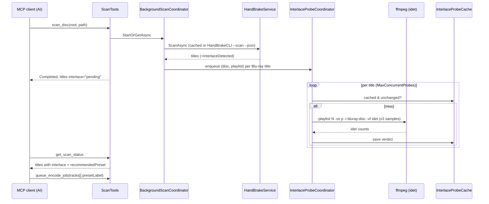
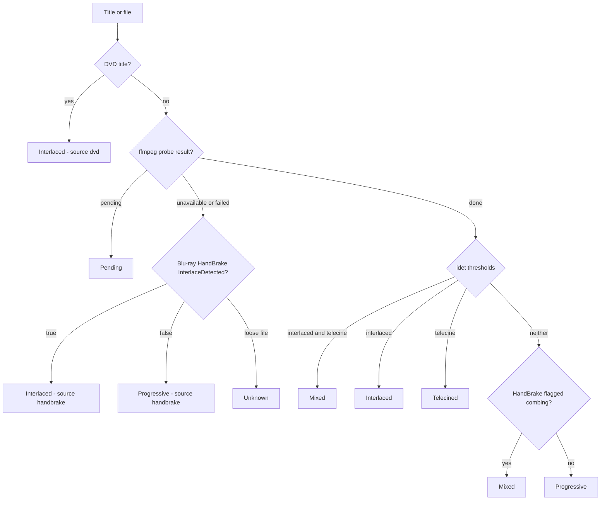
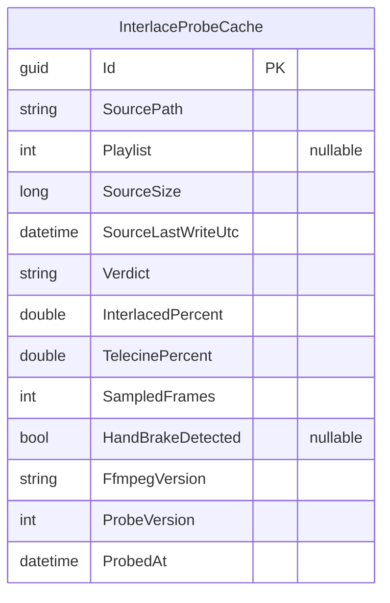

# Interlace Detection for Preset Selection

## Overview
Today the Decomb decision is a blanket rule: DVD sources use "4K AV1 Decomb", everything else "4K AV1". That is right
for DVDs (the user decombs every DVD) but wrong for many Blu-ray **extras** — behind-the-scenes pieces, interviews and
older featurettes are often 1080i or upscaled interlaced SD while the main feature is progressive — and for loose media
files from other sources. This feature produces an **interlace verdict per title / per file**, shows it in the Scan UI
and the MCP tools together with a **recommended preset**, and lets one queue job use a different preset per track.

Detection combines two signals:
1. **HandBrake** — `HandBrakeCLI --scan --json` already emits a per-title boolean `"InterlaceDetected"` (comb detection
   on its preview frames; seen in a real scan file in `handbrake-scans/`). `HandBrakeParser` currently ignores it. It is
   free (part of the scan we already run, and present in cached scan JSON) but samples only ~10 previews and does not
   distinguish telecine.
2. **ffmpeg `idet`** — decodes a few hundred frames at several points of each Blu-ray title (`bluray:` protocol with
   `-playlist`) or loose media file, and counts interlaced / progressive / repeated-field frames. This catches telecined
   material and short or mostly-static extras the HandBrake previews miss. Results are cached in the database.

DVDs are never probed: every DVD title is reported as interlaced.

## Business Domain
Disc scanning / HandBrake integration (preset selection is the consumer of the scan result).

## Goals
- Every DVD title is reported **interlaced** (source `dvd`) with no probing.
- Every Blu-ray title gets a verdict from HandBrake's flag **plus** an ffmpeg `idet` probe.
- Every loose media file (selection `file` / `folder`) gets a verdict from an ffmpeg `idet` probe.
- Verdicts are cached (keyed by path + playlist, invalidated when the source changes) so repeat scans are instant.
- The MCP tools return the verdict and a `recommendedPreset` per title / file; the **server never auto-picks** a preset.
- `queue_encode_job` accepts an optional per-track `presetLabel`, so one job can mix presets (e.g. progressive feature
  + interlaced extras).
- The Scan page shows the verdict per row and has a per-track preset selector defaulting from the verdict.

## Non-Goals
- Probing DVD titles (always interlaced by decision).
- Server-side automatic preset choice when `presetLabel` is omitted.
- Changing the presets themselves or HandBrake's decomb filter settings.
- Jellyfin-sourced re-encodes.
- Re-evaluating already-queued jobs.

---

## Architecture / Design

### Affected Projects
| Project | Role |
|---|---|
| `Sannel.Encoding.Manager.HandBrake` | Parse `InterlaceDetected` into `TitleInfo`. |
| `Sannel.Encoding.Manager.Data` | New `InterlaceProbeCache` entity (Features/Interlace/Entities) + `DbSet`. |
| `Sannel.Encoding.Manager.Migrations.Sqlite` / `.Postgres` | `AddInterlaceProbeCache` migration in **both** providers. |
| `Sannel.Encoding.Manager.Web` | New `Features/Interlace` slice (ffmpeg probe, classifier, cache, options); Scan DTOs/UI; MCP DTOs/tools/instructions; per-track preset in `EncodeJobSubmission` and `McpQueueTrack`; `Presets` options. |
| `Sannel.Encoding.Runner` | None — `EncodingWorkerService` already resolves `EncodeTrackConfig.PresetLabel` per track. |
| `Dockerfile` | Install `ffmpeg` (Debian's build includes libbluray). |
| `~/.claude/skills/encode-disc/SKILL.md` | Preset rule updated (user-level skill, outside the repo). |

### Feature Folder Structure
```
src/Sannel.Encoding.Manager.HandBrake/
├── TitleInfo.cs                       # + bool InterlaceDetected
└── HandBrakeParser.cs                 # read "InterlaceDetected" (default false when absent)

src/Sannel.Encoding.Manager.Data/Features/Interlace/Entities/
└── InterlaceProbeCache.cs             # NEW entity

src/Sannel.Encoding.Manager.Web/Features/
├── Interlace/                         # NEW slice
│   ├── Dto/
│   │   ├── InterlaceVerdict.cs        # enum: Interlaced | Telecined | Mixed | Progressive | Pending | Unknown
│   │   ├── InterlaceResult.cs         # verdict, source, interlacedPct, telecinePct, sampledFrames, recommendedPreset
│   │   └── IdetCounts.cs              # parsed idet totals
│   ├── Options/
│   │   ├── InterlaceOptions.cs        # ffmpeg path, sampling, thresholds, concurrency, timeouts
│   │   └── PresetDefaultsOptions.cs   # Presets:InterlacedPresetLabel / ProgressivePresetLabel
│   └── Services/
│       ├── IFfmpegLocator.cs / FfmpegLocator.cs        # resolve binary, version, "bluray" protocol support
│       ├── IdetParser.cs                               # parse "Multi frame detection" / "Repeated Fields"
│       ├── IInterlaceProbeService.cs / InterlaceProbeService.cs   # run ffmpeg idet per title / file (+ cache)
│       ├── IInterlaceProbeCoordinator.cs / InterlaceProbeCoordinator.cs  # background queue, dedupe, concurrency
│       └── InterlaceClassifier.cs                      # combine DVD rule + HandBrake flag + idet -> verdict
├── Scan/
│   ├── Services/BackgroundScanCoordinator.cs   # after HandBrake scan: enqueue Blu-ray title probes
│   ├── Services/EncodeJobSubmissionService.cs  # per-track preset override
│   ├── Dto/EncodeJobSubmission.cs              # track-level PresetLabel
│   └── Components/   # Titles/Chapters/MovieTitles/FolderFiles/MovieFiles views: verdict chip + per-row preset
└── Mcp/
    ├── Dto/McpTitleSummary.cs          # + interlace, interlaceSource, interlacedPercent, recommendedPreset
    ├── Dto/McpMediaFile.cs (existing file DTO)  # + same fields for loose files
    ├── Dto/McpQueueTrack.cs            # + optional presetLabel
    ├── Tools/ScanTools.cs              # verdict mapping, descriptions
    ├── Tools/FilesystemTools.cs        # list_folder_media_files: verdicts (pending -> poll)
    ├── Tools/QueueTools.cs             # per-track presetLabel description
    ├── Services/McpQueueRequestBuilder.cs   # validate per-track presetLabel
    └── McpServerInstructions.cs        # preset rule
```

### Data Model Changes
New entity **`InterlaceProbeCache`** (migrations required for **both** SQLite and PostgreSQL):

| Column | Type | Notes |
|---|---|---|
| `Id` | Guid | PK |
| `SourcePath` | string (max 1024) | physical path of the disc folder or media file |
| `Playlist` | int? | Blu-ray playlist number; null for files |
| `SourceSize` | long | file size (files) or size of the playlist's largest clip (Blu-ray) — invalidation |
| `SourceLastWriteUtc` | DateTimeOffset | invalidation |
| `Verdict` | string | Interlaced / Telecined / Mixed / Progressive / Unknown |
| `InterlacedPercent` | double | (TFF+BFF) / decided frames × 100 |
| `TelecinePercent` | double | repeated-field frames / decided frames × 100 |
| `SampledFrames` | int | |
| `HandBrakeDetected` | bool? | HandBrake flag at probe time (Blu-ray) |
| `FfmpegVersion` | string | |
| `ProbeVersion` | int | bump to invalidate after algorithm changes |
| `ProbedAt` | DateTimeOffset | |

Unique index on (`SourcePath`, `Playlist`). Entries are reused while size / last-write / `ProbeVersion` match (no TTL;
media rarely changes). `TitleInfo.InterlaceDetected` needs no schema change (the scan cache already stores raw JSON).
Queue tracks already persist `PresetLabel` per track inside the existing tracks JSON.

### API / Controller Changes
No REST changes. MCP contract changes (additive):

`scan_disc` / `get_scan_status` — each title gains:
```
interlace:          "interlaced" | "telecined" | "mixed" | "progressive" | "pending" | "unknown"
interlaceSource:    "dvd" | "handbrake+ffmpeg" | "handbrake"   // "handbrake" = ffmpeg unavailable/failed
interlacedPercent:  number | null
telecinePercent:    number | null
recommendedPreset:  "4K AV1 Decomb" | "4K AV1" | null          // null while pending
```
The scan's `status` becomes `Completed` as soon as HandBrake finishes; titles may still be `"pending"` while the
background probes run. The tool description tells the AI to keep polling `get_scan_status` until no title is pending.

`list_folder_media_files` — each file gains the same `interlace` / `interlacedPercent` / `telecinePercent` /
`recommendedPreset` fields; listing a folder enqueues probes for uncached files and returns `"pending"` for them, plus a
`pollAfterSeconds` hint; the AI calls it again until none are pending.

`queue_encode_job` — each track gains optional `presetLabel` (overrides the job-level `presetLabel`; validated against
`list_presets`). The server does **not** fill presets from the verdict.

### Service Layer
- **`HandBrakeParser.ParseScan`** — read `"InterlaceDetected"` into `TitleInfo` (false when absent).
- **`FfmpegLocator`** — resolves `Interlace:FfmpegPath` (or `ffmpeg` on PATH), reads `-version`, and checks
  `ffmpeg -hide_banner -protocols` for `bluray`. Exposes `IsAvailable`, `SupportsBluray`, `Version`. Logged once at
  startup; a missing binary or missing libbluray is a warning, not a failure.
- **`InterlaceProbeService`**
  ```
  ProbeBlurayTitleAsync(discPath, playlist, durationSeconds, ct)
      args per sample point p in SamplePoints (default 10%, 45%, 80% of duration):
        ffmpeg -nostdin -hide_banner -playlist {playlist} -ss {p} -i "bluray:{discPath}"
               -map 0:v:0 -vf idet -frames:v {FramesPerSample} -an -sn -f null -
  ProbeFileAsync(filePath, durationSeconds, ct)
      same with -i "{filePath}" (no -playlist)
  -> sum Multi-frame TFF/BFF/Progressive/Undetermined and Repeated Fields over samples (IdetParser)
  ```
  Runs through the existing `IProcessRunner` (kill process tree on timeout/cancel), `ProbeTimeoutSeconds` per sample.
  Too few decided frames (e.g. all black / undetermined) → `Unknown`.
- **Verdict thresholds** (`InterlaceOptions`):
  ```
  interlacedPct >= InterlacedThresholdPercent (10)                      -> Interlaced
  telecinePct   >= TelecineThresholdPercent (10)                        -> Telecined
  both above                                                            -> Mixed
  otherwise                                                             -> Progressive
  ```
- **`InterlaceClassifier`** (final per-title verdict)
  ```
  DVD                                   -> Interlaced, source "dvd" (never probed)
  Blu-ray, probe done                   -> idet verdict; if idet says Progressive but HandBrake
                                           InterlaceDetected == true -> Mixed (decomb is the safe choice)
  Blu-ray, ffmpeg unavailable / failed  -> HandBrake flag only (Interlaced/Progressive), source "handbrake"
  Blu-ray, probe queued                 -> Pending
  loose file                            -> idet verdict (Unknown if ffmpeg unavailable)
  recommendedPreset = verdict in {Interlaced, Telecined, Mixed} ? Presets:InterlacedPresetLabel
                    : verdict == Progressive ? Presets:ProgressivePresetLabel : null
  ```
- **`InterlaceProbeCoordinator`** (singleton, like `BackgroundScanCoordinator` / `DiscMenuService`): dedupes requests
  per (path, playlist), runs at most `MaxConcurrentProbes` ffmpeg processes, checks the cache first, writes results to
  `InterlaceProbeCache`, and stops on application shutdown.
- **`BackgroundScanCoordinator`** — after a Blu-ray HandBrake scan completes, enqueue a probe for every title at or
  above the scan's minimum duration (hidden short titles are skipped).
- **Preset defaults** — `Presets:InterlacedPresetLabel` = `"4K AV1 Decomb"`, `Presets:ProgressivePresetLabel` =
  `"4K AV1"` (the user's defaults); validated against configured presets at startup (warning if missing).
- **`EncodeJobSubmissionService`** — `track.PresetLabel = trackSubmission.PresetLabel ?? submission.PresetLabel`.
- **`McpQueueRequestBuilder`** — map and validate per-track `presetLabel`.

**Configuration (new, `appsettings.json`):**
```json
"Interlace": {
  "Enabled": true,
  "FfmpegPath": null,              // null = "ffmpeg" on PATH; Windows e.g. "C:\\ffmpeg\\bin\\ffmpeg.exe"
  "SamplePoints": [0.10, 0.45, 0.80],
  "FramesPerSample": 500,
  "ProbeTimeoutSeconds": 120,
  "MaxConcurrentProbes": 1,
  "InterlacedThresholdPercent": 10,
  "TelecineThresholdPercent": 10
},
"Presets": {
  "InterlacedPresetLabel": "4K AV1 Decomb",
  "ProgressivePresetLabel": "4K AV1"
}
```

**Cost.** Each sample decodes ~500 frames; 1080p H.264/VC-1 decodes at a few hundred fps on a modern CPU, SD MPEG-2
much faster, plus seek/open time over the network share. Expect **~5–20 s per Blu-ray title** (3 samples) and
**~2–8 s per SD file**. A Blu-ray with ~15 titles above the minimum duration adds ~1–4 minutes after the HandBrake scan
(the scan result is usable immediately; titles flip from `pending` as probes finish). A folder of ~75 SD extras takes
~3–8 minutes once, then is cached.

**Deployment.**
- *Linux / Docker:* add `ffmpeg` to the image's `apt-get install` (Debian's ffmpeg is built with libbluray).
- *Windows server:* ffmpeg is not installed today. Install a **"full"** build that includes libbluray (e.g. the
  gyan.dev *full* build or BtbN *gpl* build), set `Interlace:FfmpegPath` to `ffmpeg.exe`, and verify with
  `ffmpeg -hide_banner -protocols` (must list `bluray`). Blu-ray playback via libbluray needs no Java for this (no
  menus). Document in README / Windows install notes and in the `configure` wizard prompts. If ffmpeg is missing,
  Blu-ray titles fall back to the HandBrake flag and loose files report `unknown`.

### UI Changes
- **Scan page title/file tables** (`TitlesModeView`, `ChaptersModeView`, `MovieTitlesModeView`, `FolderFilesModeView`,
  `MovieFilesModeView`): a verdict `MudChip` per row — "Interlaced" / "Telecined" / "Mixed" (`Color.Warning`),
  "Progressive" (`Color.Default`), "Checking…" (`MudProgressCircular` small) while pending — with a tooltip giving the
  source and percentages.
- **Per-track preset selector:** each track row gets a dense `MudSelect` of presets, **defaulting from that row's
  verdict** (interlaced/telecined/mixed → `Presets:InterlacedPresetLabel`, progressive → `ProgressivePresetLabel`,
  pending/unknown → the job-level default). The existing job-level preset select stays as the default for rows the user
  has not changed. Rows refresh their default when a pending verdict arrives (unless the user changed them).
- Queue detail dialog already edits per-track presets — no change.

### Runner / Background Processing
None in the runner. Probing runs in the web app's `InterlaceProbeCoordinator` background service.

### encode-disc skill guidance (user-level skill)
Replace the source-type preset rule with:
- Use each title's / file's **`recommendedPreset`** from `scan_disc` / `get_scan_status` / `list_folder_media_files`
  (DVD titles are always interlaced → "4K AV1 Decomb"; Blu-ray titles and files follow their verdict).
- Wait for `interlace` to leave `"pending"` (poll `get_scan_status` / `list_folder_media_files`) before queuing.
- Put the preset **per track** (`tracks[].presetLabel`) when a job mixes verdicts (e.g. progressive feature +
  interlaced extras in one queue operation); the job-level `presetLabel` covers the rest.
- Only override when the user names a preset. `unknown` verdict → ask or default to the Decomb preset for SD sources.

---

## Diagrams

### Blu-ray scan with background probes


### Verdict classification


### Probe cache entity


---

## Acceptance Criteria
1. `HandBrakeParser` exposes `TitleInfo.InterlaceDetected`; unit tests cover `true`, `false` and missing field.
2. `IdetParser` unit tests parse real ffmpeg `idet` output (multi-frame and repeated-field lines) and the threshold
   logic yields Interlaced / Telecined / Mixed / Progressive / Unknown as specified.
3. DVD titles always report `interlace: "interlaced"`, `interlaceSource: "dvd"`, and no ffmpeg process is started.
4. Blu-ray titles report `pending` right after the HandBrake scan, then a verdict from HandBrake + ffmpeg; a title that
   HandBrake flags but idet calls progressive reports `mixed`.
5. With ffmpeg missing or lacking libbluray, Blu-ray titles report the HandBrake-only verdict (`interlaceSource:
   "handbrake"`) and loose files report `unknown`; a startup warning is logged; nothing fails.
6. `list_folder_media_files` returns per-file verdicts (pending → final) for loose media files.
7. Results are cached in `InterlaceProbeCache` (SQLite **and** Postgres migrations); a repeat scan of an unchanged
   source starts no ffmpeg process; a changed file (size / last-write) or bumped `ProbeVersion` re-probes.
8. `recommendedPreset` follows `Presets:InterlacedPresetLabel` / `ProgressivePresetLabel` (defaults "4K AV1 Decomb" /
   "4K AV1"); the server never assigns a preset that the request did not specify.
9. `queue_encode_job` accepts per-track `presetLabel` (validated; unknown label → clear error); tracks without one
   inherit the job-level preset; the runner encodes each track with its own preset.
10. The Scan page shows a verdict chip per row and a per-track preset selector defaulting from the verdict; user
    changes are kept when verdicts update.
11. `McpServerInstructions`, the `scan_disc` / `get_scan_status` / `list_folder_media_files` / `queue_encode_job`
    descriptions and the encode-disc skill state the rule (preset from each title's verdict; DVD = Decomb; per-track
    presets in one job; poll while pending).
12. Dockerfile installs ffmpeg; Windows install notes cover the libbluray-enabled ffmpeg build and `Interlace:FfmpegPath`.
13. CHANGELOG updated.

---

## Decisions (resolved open questions)
1. **Blu-ray detection:** HandBrake's `InterlaceDetected` **plus** an ffmpeg `idet` probe per Blu-ray title (catches
   telecine and short/static extras). Requires ffmpeg built with libbluray on the server, configurable via
   `Interlace:FfmpegPath`; results cached in a new `InterlaceProbeCache` table with migrations for both SQLite and
   Postgres. DVDs stay always-interlaced with no probe.
2. **Loose media files / folders:** yes — each file gets a verdict from an ffmpeg `idet` probe (cached).
3. **Server-side preset choice:** no auto-pick. The server returns `recommendedPreset` per title / file; the AI or the
   UI chooses explicitly.
4. **Mapping:** config keys `Presets:InterlacedPresetLabel` (default "4K AV1 Decomb") and
   `Presets:ProgressivePresetLabel` (default "4K AV1").
5. **Scan page:** per-track preset selector on each track row, defaulting from that row's verdict; the user can change
   it.

## Open Questions
None blocking. Implementation detail to confirm on real media: seek accuracy/speed of `-ss` with the `bluray:`
protocol over the network share (fallback: probe the playlist's largest `.m2ts` clip directly).
